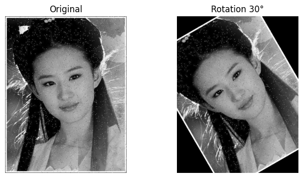

Tăng cường dữ liệu là tập hợp các kỹ thuật nhằm tạo ra các phiên bản biến đổi từ tập dữ liệu gốc, giúp tăng tính đa dạng và tăng kích thước của dữ liệu huấn luyện mà không cần thu thập thêm. Tăng cường dữ liệu giúp giảm overfitting, tăng khả năng tổng quát hoá của mô hình với dữ liệu nhiễu như ánh sáng, góc chụp, nhiễu và bị che khuất,… 

Các phép biến đổi có thể được chia thành bốn nhóm chính: 

| **Loại** | **Các phép biến đổi** | **Ghi chú** |
| --- | --- | --- |
| **Hình học** | Xoay, Lật, Co giãn, Crop | Áp dụng cho hầu hết các bài toán. |
| **Quang học** | Thay đổi Brightness, Contrast, Saturation | Mô phỏng điều kiện chụp khác nhau. |
| **Tiêm nhiễu** | Gaussian, Salt & Pepper | Tăng độ bền cho mô hình. |

## Chi tiết các phép biến đổi

### Biến đổi hình học

Mô phỏng sự thay đổi về vị trí, góc nhìn, kích thước của đối tượng trong ảnh. Phép biến đổi này bảo toàn nội dung chính nhưng thay đổi cấu trúc không gian. 

- Xoay (rotation): Xoay ảnh một góc ngẫu nhiên. Đối với bài toán phân loại, xoay giúp mô hình nhận diện đối tượng ở nhiều tư thế; với phát hiện đối tượng, cần xoay cả bounding box.
- Lật (Flip): Lật ngang hoặc lật dọc. Lật dọc ít dùng hơn vì có thể tạo ra ảnh phi thực tế (bầu trời ở dưới).
- Co giãn: Thay đổi kích thước ảnh với các tỷ lệ khác nhau. Trong huấn luyện CNN, thường kết hợp với crop ngẫu nhiên để tạo ra các vùng nhìn khác nhau.
- Crop:  Cắt một phần của ảnh, thường là hình vuông hoặc chữ nhật. Random crop giúp mô hình tập trung vào các phần khác nhau của đối tượng và học các đặc trưng cục bộ. Kết hợp với resize để đưa về cùng kích thước đầu vào.

**Ưu điểm:** đơn giản, hiệu quả, được áp dụng nhiều 

**Nhược điểm:** có thể làm mất thông tin quan trọng nếu crop quá nhỏ hoặc xoay quá lớn làm đối tượng bị biến dạng

**Ứng dụng:** Hầu hết các bài toán phân loại, phát hiện, phân đoạn ảnh.

**Code ví dụ:** 

1. rotation

```python
img = cv2.imread('image.jpg', cv2.IMREAD_GRAYSCALE)
h, w = img.shape
M = cv2.getRotationMatrix2D((w//2, h//2), 30, 1.0)
rotated = cv2.warpAffine(img, M, (w, h))

plt.figure(figsize=(8,4))
plt.subplot(1,2,1); plt.imshow(img, cmap='gray'); plt.title('Original'); plt.axis('off')
plt.subplot(1,2,2); plt.imshow(rotated, cmap='gray'); plt.title('Rotation 30°'); plt.axis('off')
plt.show()
```



1. Flip horizontal 

```python
img = cv2.imread('image.jpg', cv2.IMREAD_GRAYSCALE)
flipped = cv2.flip(img, 1)   # 1: lật ngang, 0: lật dọc

plt.figure(figsize=(8,4))
plt.subplot(1,2,1); plt.imshow(img, cmap='gray'); plt.title('Original'); plt.axis('off')
plt.subplot(1,2,2); plt.imshow(flipped, cmap='gray'); plt.title('Flip Horizontal'); plt.axis('off')
plt.show()
```


1. Co giãn 

```python
img = cv2.imread('image.jpg', cv2.IMREAD_GRAYSCALE)
h, w = img.shape
scale = 0.7
new_w, new_h = int(w*scale), int(h*scale)
scaled = cv2.resize(img, (new_w, new_h), interpolation=cv2.INTER_LINEAR)

plt.figure(figsize=(8,4))
plt.subplot(1,2,1); plt.imshow(img, cmap='gray'); plt.title('Original'); plt.axis('off')
plt.subplot(1,2,2); plt.imshow(scaled, cmap='gray'); plt.title(f'Scale {scale}'); plt.axis('off')
plt.show()
```


1. Cắt ngẫu nhiên + resize 

```python
img = cv2.imread('image.jpg', cv2.IMREAD_GRAYSCALE)
h, w = img.shape
crop_ratio = 0.7
crop_h, crop_w = int(h*crop_ratio), int(w*crop_ratio)
start_h = random.randint(0, h - crop_h)
start_w = random.randint(0, w - crop_w)
cropped = img[start_h:start_h+crop_h, start_w:start_w+crop_w]
resized = cv2.resize(cropped, (w, h), interpolation=cv2.INTER_LINEAR)

plt.figure(figsize=(8,4))
plt.subplot(1,2,1); plt.imshow(img, cmap='gray'); plt.title('Original'); plt.axis('off')
plt.subplot(1,2,2); plt.imshow(resized, cmap='gray'); plt.title('Crop+Resize'); plt.axis('off')
plt.show()
```


### Biến đổi quang học

Mục đích phép biến đổi này là mô phỏng các điều kiện ánh sáng, màu sắc, sắc độ, độ tương phản khác nhau khi chụp ảnh. Giúp mô hình mạnh hơn đối với sự thay đổi về độ sáng, màu sắc và cải thiện khả năng tổng quát trên các môi trường thực tế. 

- **Thay đổi độ sáng:** Cộng hoặc nhân một hằng số vào giá trị pixel để làm ảnh sáng hơn hoặc tối hơn. Ví dụ: nhân với hệ số trong khoảng [0.8, 1.2] hoặc cộng thêm offset.
- **Thay đổi độ tương phản:** Thay đổi sự chênh lệch giữa vùng sáng và vùng tối. Công thức: $I'=(I−mean)×α+mean$ , với $α>1$ tăng tương phản, $α<1$ giảm.
- **Thay đổi Saturation:** Điều chỉnh cường độ màu sắc. Ảnh bão hòa cao có màu rực rỡ, bão hòa thấp gần như xám. Thường áp dụng trên ảnh màu bằng cách chuyển sang không gian màu HSV, điều chỉnh kênh S.
- **Các phép khác:** Thay đổi Hue, Gamma correction, Color jitter (kết hợp ngẫu nhiên brightness, contrast, saturation, hue).

**Ưu điểm:** Mô phỏng được nhiều điều kiện ánh sáng thực tế, cải thiện độ bền màu sắc.

**Nhược điểm:** Nếu thay đổi quá mạnh có thể làm mất thông tin màu quan trọng (ví dụ phân biệt đèn giao thông đỏ/vàng).

**Code ví dụ:** 

1. Thay đổi độ sáng 

```python
plt.figure(figsize=(8,4))
plt.subplot(1,2,1); plt.imshow(img, cmap='gray'); plt.title('Original'); plt.axis('off')
plt.subplot(1,2,2); plt.imshow(bright_img, cmap='gray'); plt.title(f'Brightness +{brightness_offset}'); plt.axis('off')
plt.show()
```


1. Thay đổi độ tương phản 

```python
img = cv2.imread('img_color.jpg')
img = cv2.cvtColor(img, cv2.COLOR_BGR2RGB) 

alpha = 1.5
mean = np.mean(img)
contrast_img = np.clip((img - mean) * alpha + mean, 0, 255).astype(np.uint8)

plt.figure(figsize=(8,4))
plt.subplot(1,2,1); plt.imshow(img, cmap='gray'); plt.title('Original'); plt.axis('off')
plt.subplot(1,2,2); plt.imshow(contrast_img, cmap='gray'); plt.title(f'Contrast α={alpha}'); plt.axis('off')
plt.show()
```


1.  Thay đổi Saturation 

```python
img_bgr = cv2.imread('img_color.jpg')
hsv = cv2.cvtColor(img_bgr, cv2.COLOR_BGR2HSV).astype(np.float32)
saturation_scale = 0.3  # <1 giảm bão hòa, >1 tăng
hsv[:,:,1] = np.clip(hsv[:,:,1] * saturation_scale, 0, 255)
img_sat = cv2.cvtColor(hsv.astype(np.uint8), cv2.COLOR_HSV2BGR)

img_rgb = cv2.cvtColor(img_bgr, cv2.COLOR_BGR2RGB)
img_sat_rgb = cv2.cvtColor(img_sat, cv2.COLOR_BGR2RGB)

plt.figure(figsize=(8,4))
plt.subplot(1,2,1); plt.imshow(img_rgb); plt.title('Original'); plt.axis('off')
plt.subplot(1,2,2); plt.imshow(img_sat_rgb); plt.title(f'Saturation scale {saturation_scale}'); plt.axis('off')
plt.show()
```


1. Gamma Correction

```python
img = cv2.imread('image.jpg', cv2.IMREAD_GRAYSCALE)

gamma = 2.0  # <1 làm sáng, >1 làm tối
gamma_corrected = np.power(img / 255.0, gamma) * 255
gamma_corrected = np.clip(gamma_corrected, 0, 255).astype(np.uint8)

plt.figure(figsize=(8,4))
plt.subplot(1,2,1); plt.imshow(img, cmap='gray'); plt.title('Original'); plt.axis('off')
plt.subplot(1,2,2); plt.imshow(gamma_corrected, cmap='gray'); plt.title(f'Gamma {gamma}'); plt.axis('off')
plt.show()
```


1. Color Jitter (kết hợp ngẫu nhiên Brightness, Contrast, Saturation, Hue)

```python
img_bgr = cv2.imread('img_color.jpg')

# Random các tham số
brightness = random.uniform(0.8, 1.2)      # nhân hệ số
contrast = random.uniform(0.8, 1.2)        # nhân hệ số
saturation = random.uniform(0.8, 1.2)      # nhân hệ số
hue = random.uniform(-10, 10)              # độ thay đổi hue

# Thực hiện biến đổi
img_float = img_bgr.astype(np.float32) / 255.0
img_float = img_float * contrast * brightness
img_float = np.clip(img_float, 0, 1) * 255
img_jitter = img_float.astype(np.uint8)

# Saturation & Hue: chuyển HSV
hsv = cv2.cvtColor(img_jitter, cv2.COLOR_BGR2HSV).astype(np.float32)
hsv[:,:,1] = np.clip(hsv[:,:,1] * saturation, 0, 255)
hsv[:,:,0] = (hsv[:,:,0] + hue) % 180
img_jitter = cv2.cvtColor(hsv.astype(np.uint8), cv2.COLOR_HSV2BGR)

img_rgb = cv2.cvtColor(img_bgr, cv2.COLOR_BGR2RGB)
img_jitter_rgb = cv2.cvtColor(img_jitter, cv2.COLOR_BGR2RGB)

plt.figure(figsize=(8,4))
plt.subplot(1,2,1); plt.imshow(img_rgb); plt.title('Original'); plt.axis('off')
plt.subplot(1,2,2); plt.imshow(img_jitter_rgb); plt.title('Color Jitter (random)'); plt.axis('off')
plt.show()
```


### Tiêm nhiễu

**Mục đích:** Thêm nhiễu vào ảnh để mô hình học cách khử nhiễu hoặc trở nên bền vững với nhiễu từ cảm biến, môi trường. Đồng thời giúp chống overfitting vì mô hình không thể dựa vào các pixel chính xác tuyệt đối.

- **Nhiễu Gaussian:** Thêm nhiễu ngẫu nhiên tuân theo phân phối chuẩn với trung bình 0 và độ lệch chuẩn σ . Mô phỏng nhiễu cảm biến, nhiễu nhiệt.
- **Nhiễu Salt và Pepper:** Ngẫu nhiên đặt một số pixel thành giá trị cực đại hoặc cực tiểu. Mô phỏng lỗi truyền dẫn, pixel chết. Thường dùng tỷ lệ nhỏ (0.1–5% pixel).
- **Các loại nhiễu khác:** Nhiễu Poisson (nhiễu photon), nhiễu đốm (speckle) thường dùng trong ảnh y sinh, radar.

**Ưu điểm:** Tăng độ bền vững với dữ liệu nhiễu thực tế, cải thiện khả năng tổng quát.

**Nhược điểm:** Nếu thêm quá nhiều nhiễu, mô hình có thể học sai đặc trưng, giảm độ chính xác trên ảnh sạch.

**Ứng dụng:** Các hệ thống hoạt động trong môi trường khắc nghiệt (camera giám sát ngoài trời, ảnh y tế).

**Code:**

1. Thêm nhiễu gaussian

```python
img = cv2.imread('image.jpg', cv2.IMREAD_GRAYSCALE)

sigma = 25
noise = np.random.normal(0, sigma, img.shape)
noisy = np.clip(img.astype(np.float32) + noise, 0, 255).astype(np.uint8)

plt.figure(figsize=(8,4))
plt.subplot(1,2,1); plt.imshow(img, cmap='gray'); plt.title('Original'); plt.axis('off')
plt.subplot(1,2,2); plt.imshow(noisy, cmap='gray'); plt.title(f'Gaussian σ={sigma}'); plt.axis('off')
plt.show()
```


1. Thêm nhiễu tiêu

```python
img = cv2.imread('img_color.jpg', cv2.IMREAD_GRAYSCALE)

prob = 0.05
noisy = img.copy()
salt_mask = np.random.rand(*img.shape) < prob/2
pepper_mask = np.random.rand(*img.shape) < prob/2
noisy[salt_mask] = 255
noisy[pepper_mask] = 0

plt.figure(figsize=(8,4))
plt.subplot(1,2,1); plt.imshow(img, cmap='gray'); plt.title('Original'); plt.axis('off')
plt.subplot(1,2,2); plt.imshow(noisy, cmap='gray'); plt.title(f'Salt & Pepper {int(prob*100)}%'); plt.axis('off')
plt.show()
```


1. Nhiễu possion

```
img = cv2.imread('img_color.jpg', cv2.IMREAD_GRAYSCALE)

scale = 50
img_float = img.astype(np.float32) / scale
noisy = np.random.poisson(img_float) * scale
noisy = np.clip(noisy, 0, 255).astype(np.uint8)

plt.figure(figsize=(8,4))
plt.subplot(1,2,1); plt.imshow(img, cmap='gray'); plt.title('Original'); plt.axis('off')
plt.subplot(1,2,2); plt.imshow(noisy, cmap='gray'); plt.title('Poisson Noise'); plt.axis('off')
plt.show()
```

