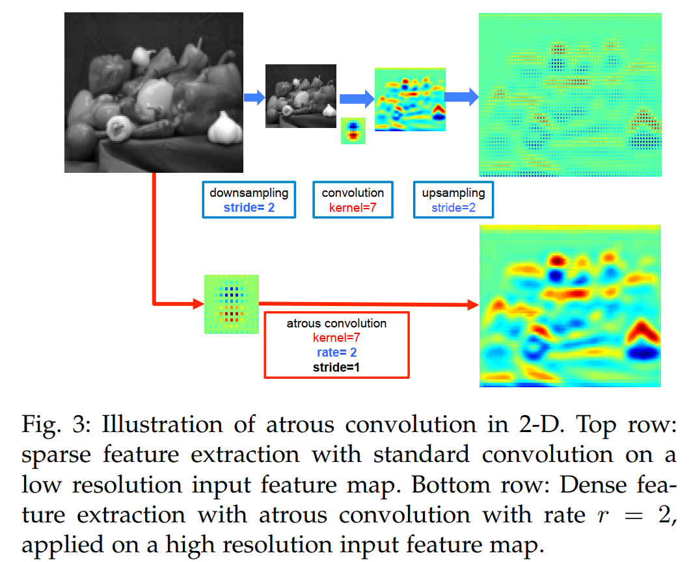

## **1. Bối cảnh bài toán và các thách thức cốt lõi**

Bài toán Semantic Segmentation yêu cầu gán nhãn chính xác cho từng pixel trong ảnh. Khác với phân loại ảnh chỉ cần biết ảnh đó có vật gì, phân đoạn ngữ nghĩa yêu cầu trả lời câu hỏi: "Pixel tại tọa độ (x,y) thuộc về đối tượng nào?".

**Vấn đề từ DCNN truyền thống:** Trong phân loại ảnh, mạng DCNN cố tình xóa bỏ thông tin vị trí chính xác để đạt được tính bất biến với biến dạng, xoay, dịch chuyển,…. Điều này giúp nhận diện vật thể ở bất kỳ đâu trong khung hình. Tuy nhiên, trong phân đoạn, việc lược bỏ chi tiết vị trí khiến bản đồ xác suất đầu ra bị mờ và ranh giới của vật thể bị nhòe, biến dạng. Ví dụ như phân đoạn xe hơi và nền, mạng biết *"vùng này có xe hơi"* nhưng không thể xác định chính xác đường viền của kính xe hay bánh xe.

Từ hạn chế trên, có thể chỉ ra 3 thách thức lớn khi áp dụng DCNN vào phân đoạn ngữ nghĩa:

1. Độ phân giải đặc trưng bị suy giảm: qua nhiều tầng pooling, kích thước ảnh bị thu nhỏ nhiều lần, làm mất thông tin biên chi tiết.
2. Sự tồn tại của đối tượng ở nhiều thang tỉ lệ: trong cùng một bức ảnh, có thể có chiếc xe tải lớn cần trường quan sát rộng và người đi bộ nhỏ sẽ cần trường quan sát hẹp.
3. Khả năng xác định chính xác vị trí không gian của đường biên, mép, ranh giới của các đối tượng bị suy giảm: do hậu quả của tính bất biến không gian từ các tầng pooling,stride.

## **2. Các đóng góp chính của DeepLabv2**

1. Giải quyết thách thức 1— giữ nguyên độ phân giải: sử dụng **atrous convolution** hay còn gọi là dilated convolution để thay thế một phần các tầng pooling, cho phép mạng tính toán đặc trưng ở bước nhảy nhỏ hơn mà vẫn mở rộng được trường quan sát mà không tăng tham số.
2. Giải quyết thách thức 2: đề xuất **Atrous Spatial Pyramid Pooling (ASPP),** nhằm phân đoạn đối tượng ở nhiều tỷ lệ kích thước khác nhau. ASPP thăm dò lớp đặc trưng tích chập đầu vào bằng các bộ lọc có nhiều tỷ lệ lấy mẫu và trường quan sát khác nhau, từ đó nắm bắt được các đối tượng cũng như ngữ cảnh ảnh ở nhiều thang tỷ lệ
3. Giải quyết thách thức 3 — phục hồi đường biên: Sử dụng Fully Connected Conditional Random Field như một tầng hậu xử lý, tận dụng thông tin màu sắc và vị trí pixel gốc để kéo các đường biên dự đoán bám sát đường biên thực tế của ảnh.

Lưu ý về backbone: deepLabv2 sử dụng mạng ResNet-101 đã được huấn luyện trước. Tác giả điều chỉnh tầng cuối của ResNet bằng cách loại bỏ tầng downsampling ở block cuối và sử dụng Atrous Conv để duy trì đặc trưng.

## 3. Phương pháp chi tiết

### 3.1. Atrous Convolution, g**iải quyết suy giảm độ phân giải và mở rộng trường quan sát**

**Vấn đề của CNN cũ:** dùng pooling/stride liên tục khiến ảnh bị teo nhỏ mất sạch thông tin ranh giới. Nếu dùng deconvolution để phóng to lại thì tốn bộ nhớ và nặng tính toán. 

**Bản chất của Atrous Conv:** chèn thêm $r-1$ số 0 xen giữa các trọng số của kernel.

**Ví dụ trực quan:** 

Giả sử ta có ma trận đặc trưng đầu vào $5 \times 5$ và một kernel $3 \times 3$:  

$$
\text{Kernel } W = \begin{bmatrix} 1 & 1 & 1 \\ 1 & 1 & 1 \\ 1 & 1 & 1 \end{bmatrix}
$$

**Trường hợp 1: Tích chập thông thường (**$r = 1$**)**

Kernel quét qua **3 ô liền kề nhau**:  $\begin{bmatrix} 1 & 1 & 1 \\ 1 & 1 & 1 \\ 1 & 1 & 1 \end{bmatrix}$

- Vùng bao phủ (Field-of-View): $3 \times 3$.
- Số tham số: $3 \times 3 = 9$.
- Số phép nhân cần tính: 9.

**Trường hợp 2: Atrous Convolution với** $r = 2$

Chèn thêm $r - 1 = 1$ số 0 xen giữa các phần tử của kernel: 

$$
 \begin{bmatrix}  1 & 0 & 1 & 0 & 1 \\  0 & 0 & 0 & 0 & 0 \\  1 & 0 & 1 & 0 & 1 \\  0 & 0 & 0 & 0 & 0 \\  1 & 0 & 1 & 0 & 1  \end{bmatrix}
$$

- Vùng bao phủ hiệu dụng: dãn rộng thành $5 \times 5$ theo công thức $k_e = k + (k-1)(r-1) =3 + (3 - 1)(2 - 1) = 5$.
- Các vị trí số $0$ bỏ qua không nhân, mạng chỉ lấy giá trị ở các điểm có số $1$.
- Số tham số thực tế: **vẫn là 9**.
- Số phép nhân cần tính: **vẫn là 9**.

**Ý nghĩa thực tế trên ảnh**

- **Với** $r=1$**:** Một pixel ở giữa chỉ nhìn thấy các pixel hàng xóm sát vách nó.
- **Với** $r=6$ **hoặc** $r=12$**:**  pixel có thể nhìn với tới các vật thể ở xa mà vẫn giữ nguyên được độ phân giải của đặc trưng. Nhờ vậy, DeepLabv2 có thể giữ đặc trưng ở tỉ lệ giảm 8 lần, giúp bản đồ đặc trưng chi tiết và sắc nét hơn, cuối cùng chỉ cần phóng to bằng phép nội suy song tuyến tính cực nhẹ.



**Nhận xét:** 

- Bản đồ đặc thu được ở phía trên xuất hiện dưới dạng lưới rời rạc, giữa các ô lưới là khoảng trống không có giá trị. Làm cho bản đồ đặc trưng mất thông tin chi tiết đặc biệt ở các vùng biên và chi tiết nhỏ, các cạnh bị nhoè, ranh giới vật thể không rõ ràng.
- Bản đồ đặc trưng ở phía dưới vừa giàu ngữ nghĩa vừa có độ phân giải cao

### 3.2. ASPP- giải quyết bài toán đa tỷ lệ


**DeepLabv2 thử nghiệm 2 hướng để xử lý biến thiên kích thước đối tượng:**

| Tiêu chí | Hướng 1: Multiscale Image Inputs (MSC)  | Hướng 2: ASPP (Đề xuất cốt lõi)  |
| --- | --- | --- |
| **Đầu vào** | Co giãn ảnh gốc thành nhiều kích thước (ví dụ: 0.5x, 0.75x, 1.0x).  | Chỉ dùng **1 kích thước ảnh gốc duy nhất**. |
| **Cách trích xuất** | Đưa từng ảnh qua toàn bộ thân mạng DCNN.  | Đưa ảnh qua backbone một lần; chỉ phân nhánh ở tầng feature map cuối cùng bằng các Atrous Conv có r khác nhau. |
| **Chi phí tính toán** | **Rất nặng** (tốn bộ nhớ và thời gian gấp bội do chạy lại DCNN nhiều lần).  | **Rất nhẹ và nhanh** (tận dụng chung feature map từ backbone). |
| **Cách hợp nhất** | Lấy giá trị lớn nhất (Max-fusion) qua các tỷ lệ. | Cộng hoặc nối (fusion) kết quả từ các nhánh song song. |

**Cụ thể về ASPP:** Tại tầng đặc trưng cuối cùng, mạng dùng 4 nhánh song song với các **dilatation rate** khác nhau (6,12,18,24), tạo thành các đặc trưng đa dạng về tỉ lệ. Sau đó, các đặc trưng này được nối (concatenate) ****lại với nhau theo kênh, rồi đưa qua một lớp tích chập `1x1` để tổng hợp thông tin. Giải pháp này nhanh gấp nhiều lần so với chạy đa tỉ lệ ảnh đầu vào mà vẫn đạt độ chính xác tương đương.

**Code:**

```python
import torch
import torch.nn as nn

class ASPP(nn.Module):
    def __init__(self, in_channels, out_channels):
        super(ASPPv2, self).__init__()
        
        # 4 nhánh Atrous Conv 3x3 với các rate khác nhau
        self.conv6 = nn.Conv2d(in_channels, out_channels, kernel_size=3, padding=6, dilation=6, bias=False)
        self.conv12 = nn.Conv2d(in_channels, out_channels, kernel_size=3, padding=12, dilation=12, bias=False)
        self.conv18 = nn.Conv2d(in_channels, out_channels, kernel_size=3, padding=18, dilation=18, bias=False)
        self.conv24 = nn.Conv2d(in_channels, out_channels, kernel_size=3, padding=24, dilation=24, bias=False)
        
        # Gộp các nhánh
        self.fusion = nn.Conv2d(4 * out_channels, out_channels, kernel_size=1, bias=False)
    
    def forward(self, x):
        res6 = self.conv6(x)
        res12 = self.conv12(x)
        res18 = self.conv18(x)
        res24 = self.conv24(x)
        
        out = torch.cat([res6, res12, res18, res24], dim=1)
        out = self.fusion(out)
        return out
```

### **3.3. Dense CRF – phục hồi đường biên sắc nét cho đối tượng**

**Vấn đề đầu ra của DCNN:** Do tính bất biến, bản đồ xác suất từ DCNN mờ và trơn. Để khắc phục, tác giả dùng Fully Connected CRF. 


Điểm đặc biệt của Dense CRF là xây dựng đồ thị kết nối tất cả các cặp điểm ảnh với nhau không chỉ hàng xóm, cho phép lan truyền ngữ cảnh toàn cục và phục hồi chi tiết tinh xảo.


**Công thức:** Mục tiêu của CRF là tìm cách gán nhãn $x$ cho từng điểm ảnh sao cho hàm năng lượng $E(x)$ đạt giá trị nhỏ nhất:

$$
E(x) = \sum_{i} \theta_i(x_i) + \sum_{i, j} \theta_{ij}(x_i, x_j)
$$

Trong đó:

- $x_i$ là nhãn được gán cho điểm ảnh $i$.
- $i, j$ chạy qua toàn bộ các điểm ảnh trên ảnh gốc.

**Thành phần 1: Năng lượng đơn vị (Unary Potential) $\theta_i(x_i)$**

Đại diện cho chi phí khi gán nhãn $x_i$ cho điểm ảnh $i$, lấy trực tiếp từ đầu ra của mạng DCNN:  

$$
\theta_i(x_i) = -\log P(x_i)
$$

- $P(x_i)$ là xác suất điểm ảnh $i$ thuộc lớp $x_i$ do DCNN tính toán (sau khi phóng to bản đồ điểm số về kích thước ảnh gốc).
- Nếu DCNN dự đoán xác suất rất cao ($P(x_i) \approx 1$), chi phí $\theta_i \approx 0$. Ngược lại, nếu dự đoán sai lệch, chi phí phạt sẽ tăng vọt.

**Thành phần 2: Năng lượng cặp (Pairwise Potential) $\theta_{ij}(x_i, x_j)$**

Đại diện cho mối quan hệ và độ tương đồng giữa hai điểm ảnh bất kỳ $i$ và $j$ trên toàn ảnh:  

$$
\theta_{ij}(x_i, x_j) = \mu(x_i, x_j) \left[ \underbrace{w_1 \exp\left( -\frac{\Vert{}p_i - p_j\Vert{}^2}{2\sigma_\alpha^2} - \frac{\Vert{}I_i - I_j\Vert{}^2}{2\sigma_\beta^2} \right)}_{\text{Bilateral Kernel (Nhân song phương)}} + \underbrace{w_2 \exp\left( -\frac{\Vert{}p_i - p_j\Vert{}^2}{2\sigma_\gamma^2} \right)}_{\text{Spatial Kernel (Nhân không gian)}} \right]
$$

Thành phần này có tác dụng phạt nặng khi hai điểm ảnh gần nhau và tương tự về màu sắc lại bị gán nhãn khác nhau. Ngược lại, nếu chúng nằm ở hai phía của một cạnh biên thực sự, mức phạt sẽ được nới lỏng.

Chi tiết các ký hiệu và ý nghĩa:

- **Hàm điều kiện Potts** $\mu(x_i, x_j)$**:**Chỉ áp dụng hình phạt khi hai điểm ảnh bị gán khác nhãn nhau. Nếu cùng nhãn thì số hạng này bằng 0.

$$
\mu(x_i, x_j) = \begin{cases} 1 & \text{nếu } x_i \neq x_j \\ 0 & \text{nếu } x_i = x_j \end{cases}
  
$$

- **Bilateral Kernel (Số hạng thứ nhất):** Phụ thuộc đồng thời vào tọa độ vị trí $p = (x, y)$ và giá trị màu sắc $I = (R, G, B)$.
    - *Ý nhĩa:* Ép các điểm ảnh có **vị trí gần nhau VÀ màu sắc tương đồng thì phải được gán cùng một nhãn**.
    - Khi xuất hiện một cạnh biên thực tế trên ảnh (màu sắc đột ngột thay đổi mạnh, ví dụ giữa nền trời xanh và cánh máy bay trắng), giá trị của hàm mũ suy giảm về gần 0, chi phí phạt biến mất. Nhờ đó, ranh giới phân đoạn được phép "cắt" chính xác men theo đường viền thực tế.
- **Spatial Kernel (Số hạng thứ hai):** Chỉ phụ thuộc vào khoảng cách không gian $\Vert{}p_i - p_j\Vert{}$.
    - *Ý nghĩa:* Đóng vai trò làm mượt không gian cơ bản, loại bỏ các điểm ảnh dị biệt hoặc nhiễu lốm đốm.
- **Các siêu tham số:**
    - $w_1, w_2$: Trọng số điều chỉnh mức độ đóng góp của từng nhân.
    - $\sigma_\alpha, \sigma_\beta, \sigma_\gamma$: Kiểm soát độ nhạy theo quy mô khoảng cách không gian và độ chênh lệch dải màu RGB.

**Về tính toán:** Vì là đồ thị đầy đủ, tối ưu chính xác là bất khả thi. Tuy nhiên, DeepLabv2 sử dụng thuật toán xấp xỉ **Mean Field** và tận dụng thuật toán lọc dựa trên cấu trúc lưới **Permutohedral Lattice**, giúp chạy CRF ở tốc độ cực nhanh (< 0.5 giây/ảnh trên CPU).

Ý tưởng đơn giản: **Các pixel gần nhau và có màu giống nhau thì nên được gán cùng một nhãn.**

- Nếu hai pixel kề nhau, một cái trắng, một cái trắng (cùng màu) → chúng khuyến khích nhau chọn cùng nhãn (ví dụ: cùng là "áo").
- Nếu hai pixel nằm ở hai bên một đường biên (ví dụ: một bên trời xanh, một bên tóc đen) → chúng **không** ép nhau phải cùng nhãn, vì đó là biên thật.

Dense CRF cho phép **mọi cặp pixel** trong ảnh nói chuyện với nhau. Điều này giúp loại bỏ nhiễu lác đác và làm biên rõ nét.

**Code mẫu cho dense CRF**

```python
class DenseCRFPostProcessor:
    def __init__(self, iterations=10, w1=5.0, w2=3.0, sigma_alpha=40.0, sigma_beta=13.0, sigma_gamma=3.0):
        self.iterations = iterations
        self.w1 = w1
        self.w2 = w2
        self.sigma_alpha = sigma_alpha
        self.sigma_beta = sigma_beta
        self.sigma_gamma = sigma_gamma
        try:
            import pydensecrf.densecrf as dcrf
            from pydensecrf.utils import unary_from_softmax
            self.has_pydensecrf = True
            self.dcrf = dcrf
            self.unary_from_softmax = unary_from_softmax
        except ImportError:
            self.has_pydensecrf = False

    def refine_single_image(self, prob_map: np.ndarray, raw_rgb: np.ndarray) -> np.ndarray:
        h, w = prob_map.shape
        if self.has_pydensecrf:
            prob_fg = np.clip(prob_map, 1e-6, 1.0 - 1e-6)
            prob_bg = 1.0 - prob_fg
            probs = np.stack([prob_bg, prob_fg], axis=0)
            unary = self.unary_from_softmax(probs)
            unary = np.ascontiguousarray(unary)
            d = self.dcrf.DenseCRF2D(w, h, 2)
            d.setUnaryEnergy(unary)
            d.addPairwiseGaussian(sxy=self.sigma_gamma, compat=self.w2, kernel=self.dcrf.DIAG_KERNEL, normalization=self.dcrf.NORMALIZE_SYMMETRIC)
            d.addPairwiseBilateral(sxy=self.sigma_alpha, srgb=self.sigma_beta, rgbim=np.ascontiguousarray(raw_rgb), compat=self.w1, kernel=self.dcrf.DIAG_KERNEL, normalization=self.dcrf.NORMALIZE_SYMMETRIC)
            Q = d.inference(self.iterations)
            return np.array(Q)[1].reshape((h, w))
        else:
            prob_fg = np.clip(prob_map, 1e-6, 1.0 - 1e-6)
            q = prob_fg.copy()
            for _ in range(self.iterations):
                bilateral = cv2.bilateralFilter(q.astype(np.float32), d=7, sigmaColor=self.sigma_beta, sigmaSpace=self.sigma_alpha)
                spatial = cv2.GaussianBlur(q.astype(np.float32), ksize=(5, 5), sigmaX=self.sigma_gamma)
                pairwise = self.w1 * (bilateral - 0.5) + self.w2 * (spatial - 0.5)
                logit_comb = np.log(prob_fg / (1.0 - prob_fg)) + pairwise
                q = 1.0 / (1.0 + np.exp(-logit_comb))
            return q

    def refine_batch(self, probs_tensor: torch.Tensor, raw_rgb_batch: np.ndarray) -> np.ndarray:
        probs_np = probs_tensor.detach().cpu().numpy()
        if probs_np.ndim == 4:
            probs_np = probs_np[:, 0]
        refined = [self.refine_single_image(probs_np[i], raw_rgb_batch[i]) for i in range(len(probs_np))]
        return np.array(refined)

crf_processor = DenseCRFPostProcessor()
print(f'Khởi tạo Dense CRF thành công! Engine: {"pydensecrf C++" if crf_processor.has_pydensecrf else "Mean-Field Approximation (PyTorch/OpenCV)"}')

```

### **Tóm lại: Dense CRF là gì?**

- Là một công cụ **hậu xử lý**.
- Làm **sắc nét** biên của vật thể.
- **Loại bỏ nhiễu** lẻ tẻ.
- Hoạt động bằng cách **so sánh vị trí và màu sắc** của tất cả các cặp pixel.
- Chạy rất nhanh (chưa đến 0.5 giây trên CPU) nhờ một mẹo tính toán thông minh.

## Case Study: Phân đoạn tổn thương da trên ISIC 2018

### Triển khai mô hình

1. ASPP

```python
class ASPPBranch(nn.Module):
    def __init__(self, in_channels: int, out_channels: int, dilation: int):
        super().__init__()
        self.conv = nn.Sequential(
            nn.Conv2d(in_channels, out_channels, kernel_size=3, padding=dilation, dilation=dilation, bias=True)
        )
    def forward(self, x):
        return self.conv(x)
        
 class ASPPModule(nn.Module):
    def __init__(self, in_channels: int, num_classes: int = 1, dilations: list = [6, 12, 18, 24]):
        super().__init__()
        self.branches = nn.ModuleList([
            ASPPBranch(in_channels, num_classes, dilation=r) for r in dilations
        ])
    def forward(self, x):
        return sum(branch(x) for branch in self.branches)
```

1. Backbone

```python
class DeepLabv2ResNet(nn.Module):
    def __init__(self, backbone_name: str = 'resnet50', pretrained: bool = True, num_classes: int = 1, dilations: list = [6, 12, 18, 24]):
        super().__init__()
        self.backbone_name = backbone_name
        self.num_classes = num_classes

        if backbone_name == 'resnet50':
            weights = models.ResNet50_Weights.DEFAULT if pretrained else None
            resnet = models.resnet50(weights=weights)
            in_channels = 2048
        elif backbone_name == 'resnet101':
            weights = models.ResNet101_Weights.DEFAULT if pretrained else None
            resnet = models.resnet101(weights=weights)
            in_channels = 2048
        elif backbone_name == 'resnet34':
            weights = models.ResNet34_Weights.DEFAULT if pretrained else None
            resnet = models.resnet34(weights=weights)
            in_channels = 512
        else:
            raise ValueError(f'Không hỗ trợ backbone: {backbone_name}')

        self.conv1 = resnet.conv1
        self.bn1 = resnet.bn1
        self.relu = resnet.relu
        self.maxpool = resnet.maxpool

        self.layer1 = resnet.layer1
        self.layer2 = resnet.layer2
        self.layer3 = resnet.layer3
        self._modify_layer_dilation(self.layer3, dilation=2)
        self.layer4 = resnet.layer4
        self._modify_layer_dilation(self.layer4, dilation=4)

        self.aspp = ASPPModule(in_channels=in_channels, num_classes=num_classes, dilations=dilations)

    def _modify_layer_dilation(self, layer, dilation: int):
        for m in layer.modules():
            if isinstance(m, nn.Conv2d):
                if m.stride == (2, 2):
                    m.stride = (1, 1)
                if m.kernel_size == (3, 3):
                    m.dilation = (dilation, dilation)
                    m.padding = (dilation, dilation)

    def forward(self, x):
        input_size = x.shape[2:]
        x = self.conv1(x)
        x = self.bn1(x)
        x = self.relu(x)
        x = self.maxpool(x)
        x = self.layer1(x)
        x = self.layer2(x)
        x = self.layer3(x)
        x = self.layer4(x)
        logits_low = self.aspp(x)
        logits = F.interpolate(logits_low, size=input_size, mode='bilinear', align_corners=True)
        return logits
```

1. Dense CRF

```python
class DenseCRFPostProcessor:
    def __init__(self, iterations=10, w1=5.0, w2=3.0, sigma_alpha=40.0, sigma_beta=13.0, sigma_gamma=3.0):
        self.iterations = iterations
        self.w1 = w1
        self.w2 = w2
        self.sigma_alpha = sigma_alpha
        self.sigma_beta = sigma_beta
        self.sigma_gamma = sigma_gamma
        try:
            import pydensecrf.densecrf as dcrf
            from pydensecrf.utils import unary_from_softmax
            self.has_pydensecrf = True
            self.dcrf = dcrf
            self.unary_from_softmax = unary_from_softmax
        except ImportError:
            self.has_pydensecrf = False

    def refine_single_image(self, prob_map: np.ndarray, raw_rgb: np.ndarray) -> np.ndarray:
        h, w = prob_map.shape
        if self.has_pydensecrf:
            prob_fg = np.clip(prob_map, 1e-6, 1.0 - 1e-6)
            prob_bg = 1.0 - prob_fg
            probs = np.stack([prob_bg, prob_fg], axis=0)
            unary = self.unary_from_softmax(probs)
            unary = np.ascontiguousarray(unary)
            d = self.dcrf.DenseCRF2D(w, h, 2)
            d.setUnaryEnergy(unary)
            d.addPairwiseGaussian(sxy=self.sigma_gamma, compat=self.w2, kernel=self.dcrf.DIAG_KERNEL, normalization=self.dcrf.NORMALIZE_SYMMETRIC)
            d.addPairwiseBilateral(sxy=self.sigma_alpha, srgb=self.sigma_beta, rgbim=np.ascontiguousarray(raw_rgb), compat=self.w1, kernel=self.dcrf.DIAG_KERNEL, normalization=self.dcrf.NORMALIZE_SYMMETRIC)
            Q = d.inference(self.iterations)
            return np.array(Q)[1].reshape((h, w))
        else:
            prob_fg = np.clip(prob_map, 1e-6, 1.0 - 1e-6)
            q = prob_fg.copy()
            for _ in range(self.iterations):
                bilateral = cv2.bilateralFilter(q.astype(np.float32), d=7, sigmaColor=self.sigma_beta, sigmaSpace=self.sigma_alpha)
                spatial = cv2.GaussianBlur(q.astype(np.float32), ksize=(5, 5), sigmaX=self.sigma_gamma)
                pairwise = self.w1 * (bilateral - 0.5) + self.w2 * (spatial - 0.5)
                logit_comb = np.log(prob_fg / (1.0 - prob_fg)) + pairwise
                q = 1.0 / (1.0 + np.exp(-logit_comb))
            return q

    def refine_batch(self, probs_tensor: torch.Tensor, raw_rgb_batch: np.ndarray) -> np.ndarray:
        probs_np = probs_tensor.detach().cpu().numpy()
        if probs_np.ndim == 4:
            probs_np = probs_np[:, 0]
        refined = [self.refine_single_image(probs_np[i], raw_rgb_batch[i]) for i in range(len(probs_np))]
        return np.array(refined)

crf_processor = DenseCRFPostProcessor()
print(f'Khởi tạo Dense CRF thành công! Engine: {"pydensecrf C++" if crf_processor.has_pydensecrf else "Mean-Field Approximation (PyTorch/OpenCV)"}')
```

### Kết quả

| Chỉ số Đánh Giá | DeepLabv2 | DeepLabv2 + Dense CRF  |
| --- | --- | --- |
| DICE                  | 0.8846 | 0.8859 |
| IOU                   | 0.8083 | 0.8104 |
| PRECISION | 0.8990 | 0.9018 |
| RECALL | 0.9025 | 0.9024 |
| SPECIFICITY | 0.9700 | 0.9706 |

### File notebook:

> **Tải về Jupyter Notebook:** <a href="/blog/deeplabv2/deeplabv2_case_study.ipynb" download="deeplabv2_case_study.ipynb">**`deeplabv2_case_study.ipynb`**</a> (hoặc nhấp chuột phải chọn *Save Link As...*)

## Tài liệu tham khảo

**DeepLab: Semantic Image Segmentation with Deep Convolutional Nets, Atrous Convolution, and Fully Connected CRFs ([link](https://arxiv.org/abs/1606.00915))**