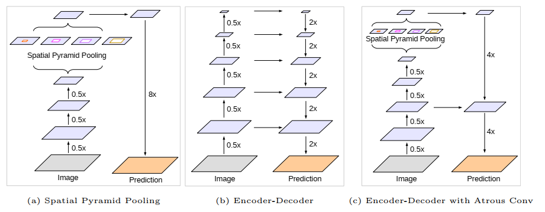

## Động lực nghiên cứu:

- **Mâu thuẫn kỹ thuật:** Để hiểu bối cảnh toàn cục (high-level context), mạng cần giảm chiều sâu không gian bằng striding/pooling, nhưng điều này làm mờ hoặc mất hẳn đường biên đối tượng.
- **Hạn chế của tiền nhiệm:** DeepLabv3 dùng ASPP bắt ngữ nghĩa rất tốt nhưng khôi phục ảnh bằng phép nội suy song tuyến tính (Bilinear Upsampling x16) ngây thơ, khiến ranh giới vật thể bị nhòe. Còn cấu trúc Encoder-Decoder thông thường (như U-Net) lại tốn kém hoặc thiếu cơ chế trích xuất đa quy mô mạnh mẽ ở tầng đáy.

## 1. Hai hướng tiếp cận trước đây và hạn chế của chúng

### 1.1. Hướng 1: Spatial Pyramid Pooling

- Đại diện: DeepLabV3, PSPNet
- Cách làm: Dùng song osong các phép Atrous Conv với nhiều rate để trích xuất ngữ cảnh.
- Ưu điểm: bắt được ngữ nghĩa đa tỉ lệ.
- Nhược điểm: : Do ảnh đã bị nén qua Stride/Pooling, mất chi tiết biên. Việc khôi phục chỉ bằng phép nội suy song tuyến (bilinear) rất thô sơ, làm nhòe ranh giới vật thể.

### 1.2. Hướng 2: Encoder-Decoder

- **Cách làm:** Encoder thu nhỏ để học ngữ nghĩa, Decoder phóng to và ghép nối với các đặc trưng nông để khôi phục không gian.
- **Ưu điểm:** Phục hồi biên rất sắc nét.
- **Nhược điểm:** Encoder thông thường không có cơ chế trích xuất ngữ cảnh đa tỉ lệ đủ mạnh, nên thiếu thông tin toàn cục cho những vật thể lớn hoặc phức tạp.

## 2. Phương pháp của DeepLabV3+

Lấy DeepLabV3 làm Encoder để nắm ngữ cảnh, và thêm một Decoder đơn giản nhưng hiệu quả để lấy lại biên mà không làm tăng quá nhiều tính toán. 

**3 đóng góp chính:** 

1. Kiến trúc Encoder-Decoder mới: dùng deeplabv3 làm encoder, và một decoder nhẹ với các bước:
    - Upsample encoder feature lên 4x
    - Lấy đặc trưng tầng thấp từ backbone cùng kích thước
    - Dùng Conv 1x1 nén kênh tầng thấp xuống 48 để tránh lấn át ngữ nghĩa
    - Ghép nối và dùng 2 lớp Conv 3x3 với 256 filters để lai ghép, sau đó upsample 4x lên kịch thước gốc
2. Nén kênh tầng thấp: Thay vì dùng cả đặc trưung nông, ép xuống 48 kênh bằng Conv 1x1. Điều này cân bằng sức ảnh hưởng giữa thông tin hình học và ngữ nghĩa, giúp việc học ổn định hơn. 
3. Tối ưu tốc độ và độ chính xác với Atrous Separable Convolution + Modified Xception
    - **Atrous Separable Conv:** Kết hợp Depthwise Separable Conv với Atrous. Áp dụng cho cả ASPP và Decoder, giảm rất nhiều lượng tính toán.
    - **Modified Xception:**
        - Entry Flow: nhẹ để tiết kiệm bộ nhớ.
        - Thay toàn bộ Max Pooling bằng Depthwise Conv có Stride → cho phép áp dụng Atrous tại mọi vị trí, linh hoạt chuyển đổi Output Stride.
        - Thêm Batch Normalization + ReLU sau mỗi Depthwise Conv .

## 3. Đi sâu vào từng phần

### 3.1. Atrous Separable Convolution

Thay vì dùng tích chập thông thường, tác giả tích hợp Atrous Convolution vào Depthwise Separabel Convolution:

1. Depthwise Convolution (hình 3a): Áp dụng một bộ lọc không gian duy nhất cho từng kênh riêng rẽ mà không cho các kênh giao tiếp với nhau
2. Pointwise Convolution (hình 3b): Áp dụng tích chập $1 \times1$ qua toàn bộ các kênh để tổng hợp và hoán đổi số lượng kênh từ $C_{in} \to C_{out}$.
3. Atrous Depthwise Convolution (hình 3c): Tác giả đưa tham số r trực tiếp vào depthwise convolution. 
    - Bản chất kỹ thuật: bước quét không gian độc lập từng kênh được mở rộng tầm nhìn bằng atrous rate $r$, sau đó bước pointwise $1 \times1$ gom thông tin lại.
    - Kết quả: Giảm độ phức tạp tính toán so với Atrous thông thường mà khả năng biểu diễn không bị giảm.

### 3.2. Encoder

- Output Stride (OS): Tỉ số thu nhỏ kích thước không gian giữa ảnh đầu vào so với feature map đầu ra.
    - Mạng phân loại ảnh thông thường nén tới $OS = 32$.
    - Trong DeepLabv3+, tác giả cáu hình Encoder ở mức $OS=16$ bằng cách bỏ bớt stride ở block cuối và thay bằng atrous convolution. Nếu tài nguyên tính toán dư dả, có thể cho $OS=8$.
- Cụm Atrous Spatial Pyramid Pooling:
    - Đầu ra của backbone được chuyển qua ASPP gồm 5 nhánh song song: một conv $1 \times 1$, ba nhánh atrous conv $3 \times 3$ với $r = (6, 12, 18)$ (khi $OS = 16$), và một nhánh **Image Pooling**.
    - Toàn bộ 5 nhánh được ghép kênh lại và chiếu qua một conv $1 \times 1$ để nén về **256 channels**.
- Đầu ra này mang nhiều thông tin ngữ nghĩa, nhưng kích thước không gian mới chỉ bằng $1/16$ ảnh gốc.

### 3.3. Decoder

| **Bước** | **Thao tác** | **Kích thước (H,W)** | **Số kênh** | **Mục đích** |
| --- | --- | --- | --- | --- |
| 1 | Upsample x4 (bilinear) | H/4 | 256 | Đưa ngữ nghĩa lên gần với tầng nông. |
| 2 | Lấy đặc trưng tầng thấp từ backbone (Block 1 – Xception) | H/4 | 256/512 | Giữ thông tin biên chi tiết. |
| 3 | Conv 1x1 nén kênh tầng thấp | H/4 | **48** | Giảm trọng số để không lấn át ngữ nghĩa  |
| 4 | Concatenate (ghép kênh) | H/4 | 256 + 48 = 304 | Hội tụ cả ngữ cảnh và biên. |
| 5 | Hai lớp Conv 3x3 (256 filters, BN, ReLU) | H/4 | 256 | Trộn thông tin, tinh chỉnh biên (2 lớp tốt hơn 1 hoặc 3). |
| 6 | Upsample x4 (bilinear) | H | Số lớp | Đưa về kích thước ảnh gốc và dự đoán nhãn pixel. |

### Modified Aligned Xception

| **Thành phần** | **Thay đổi so với Xception gốc** | **Lý do** |
| --- | --- | --- |
| **Entry Flow** | Giữ nguyên (không làm sâu) | Tiết kiệm bộ nhớ vì Entry Flow làm việc trên ảnh kích thước lớn. |
| **Middle Flow** | Lặp 16 thay vì 8 lần | Tăng độ sâu học ngữ nghĩa, tăng độ chính xác. |
| **Max Pooling** | Thay bằng Depthwise Separable Conv + Stride | Cho phép áp dụng Atrous Conv linh hoạt, điều chỉnh Output Stride dễ dàng. |
| **Sau mỗi Depthwise Conv** | Thêm BN + ReLU | Cải thiện khả năng học. |

## Case Study

> **Tải về Jupyter Notebook:** <a href="/blog/deeplabv3p/deeplabv3plus_case_study.ipynb" download="deeplabv3plus_case_study.ipynb">**`deeplabv3plus_case_study.ipynb`**</a> (hoặc nhấp chuột phải chọn *Save Link As...*)

## Kết luận

| **Thành phần** | **Đóng góp** |
| --- | --- |
| **Encoder (DeepLabv3 + ASPP)** | Nắm ngữ cảnh đa quy mô, đặc biệt tốt cho vật thể lớn. |
| **Decoder (nhẹ)** | Khôi phục biên sắc nét nhờ tận dụng đặc trưng nông và nén kênh hợp lý. |
| **Atrous Separable Conv** | Giảm FLOPs giúp mô hình chạy nhanh mà vẫn mạnh. |
| **Modified Xception** | Cung cấp backbone linh hoạt, có thể co giãn Output Stride và tăng cường học phi tuyến. |

## Tài liệu tham khảo

**Encoder-Decoder with Atrous Separable Convolution for Semantic Image Segmentation (**[link](https://arxiv.org/abs/1802.02611))