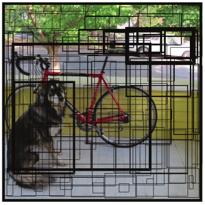

## Vấn đề của one-stage

Trước khi có Focal Loss, đa số mô hình two-stage đều đạt kết quả cao hơn mô hình one-stage như YOLOv2 hay SSD. Nguyên nhân là trong object detection, các anchor box được sinh ra với số lượng cực lớn, nhưng phần lớn và nền và chỉ có một phần nhỏ là foreground. Ví dụ trong 200k anchor box thì có thể có tới 190k–199k là background, chỉ khoảng 1k–10k là foreground. Do đó nếu dùng cross entropy thông thường, mô hình sẽ bị chi phối bởi background là các mẫu dễ, dẫn đến việc học background là chủ yếu và kém hiệu quả với vật thể. Vì vậy việc thiết kế một hàm loss phù hợp cho object detection là rất quan trọng.

Năm 2018, nhóm nghiên cứu tại Facebook AI Research (FAIR) đã đề xuất **Focal Loss**, giải quyết vấn đề mất cân bằng lớp này và cải thiện đáng kể kết quả của các mô hình one-stage.

## Focal Loss

Focal loss là hàm loss function lần đầu được giới thiệu trong RetinaNet. Hàm loss function này đã chứng minh được tính hiệu quả trong các bài toán object detection. Đây là lớp bài toán có sự mất cân bằng nghiêm trọng giữa hai class positive (các bounding box có chứa object) và negative (các bounding box không chứa object). Thường thì *negative* có số lượng lớn hơn *positive* rất nhiều. Lấy ví dụ như hình bên dưới :

Chỉ có 4 bounding box thuộc positive (đường viền in đậm), các trường hợp còn lại thuộc nhóm negative.

Để giải quyết vấn đề này, bài báo **"Focal Loss for Dense Object Detection"** đã đề xuất hàm **Focal Loss** với hai tham số điều chỉnh là $α$ **và $γ$ **:

$$
\text{FL}(p_t) = -\alpha_t (1 - p_t)^\gamma \log(p_t)
$$

Trong đó, $γ$ **thường được chọn trong khoảng $[0,5]$. 

**Cơ chế hoạt động:**

1. Với mẫu dễ dự đoán: khi mô hình dự đoán đúng và tự tin, xác suất $q_t$ thường có giá trị cao. Khi đó, nhân từ $(1-q_t)^{\gamma}$ sẽ tiến về 0. Điều này làm giảm rất nhiều đống góp của các mẫu dễ vào hàm loss, giúp mô hình không bị phân tâm bởi những thứ đã học tốt rồi. 
2. Mẫu khó dự đoán:  Khi mô hình dự đoán sai hoặc chưa tự tin, $q_t$  là một giá trị nhỏ. Lúc này, $(1-q_t)^{\gamma}$ sẽ tiến về 1. Do đó, mẫu khó vẫn giữ được độ lớn đóng góp vào hàm loss, buộc mô hình phải tập trung học các trường hợp này.

## RetinaNet

Retina Net là một mô hình giải quyết được `vấn đề mất cân bằng trong phân phối giữa foreground và background trong các bài toán one-stage detection` bằng cách sử dụng hàm *focal loss* thay cho *cross entropy.*  

Kiến trúc trong bài báo gốc tác giả giới thiệu gồm hai phase:

Kiến trúc FPN. Bao gồm hai nhánh là Bottom-Up bên trái và Top-Down bên phải.

- Phase 1: là một feature extractor kết hợp giữa Resnet + FPN, có tác dụng trích lọc đặc trưng và trả về các feature map. Mạng FPN (Featuer Pyramid Network) sẽ tạo ra một multi-head dạng kim tự tháp.
    - **Nhánh Bottom-Up:** Là một mạng Convolutional Neural Network (ở đây là ResNet) có nhiệm vụ trích xuất đặc trưng. Qua mỗi tầng, kích thước không gian của feature map giảm dần, tạo ra các mứckhác nhau. Các tầng càng sâu thì ngữ nghĩa càng mạnh nhưng độ phân giải càng thấp.
    - **Nhánh Top-Down:** Có nhiệm vụ lan truyền ngữ nghĩa mạnh từ các tầng sâu xuống. Nhánh này thực hiện **upsampling** (thường là nhân đôi kích thước) các feature map từ mức cao hơn.
    - **Kết nối ngang (Lateral Connections):** Để kết hợp thông tin, feature map từ nhánh Bottom-Up sẽ được đưa qua một lớp **tích chập 1x1** nhằm giảm số channel cho khớp với nhánh Top-Down. Sau đó, hai feature map này được cộng với nhau bằng phép **cộng element-wise**.

Kiến trúc của RetinaNet

Các feature map từ FPN được đưa vào hai nhánh dự báo song song, gọi là **class subnet** và **box subnet**. Kiến trúc của mỗi subnet gồm một chuỗi các lớp tích chập (thường là 4 lớp conv 3x3 với 256 channels) để trích xuất đặc trưng, sau đó là một lớp tích chập cuối cùng để tạo ra kết quả dự báo.

- **Class subnet:** Dự báo phân phối xác suất cho từng lớp đối tượng tại mỗi anchor. Output của nhánh này có số channel là $K×A$, trong đó $K$ là số lượng lớp đối tượng và $A$ là số lượng anchor tại mỗi vị trí không gian. Với mỗi anchor, ta thu được một vector $K$chiều biểu diễn xác suất thuộc các lớp.
- **Box subnet:** Dự báo tọa độ của bounding box. Output của nhánh này có số channel là $4×A$, tương ứng với 4 giá trị cho mỗi anchor. Các giá trị này thường là **offset** so với anchor gốc để hiệu chỉnh anchor thành bounding box chính xác hơn.

## Kết quả của paper:

## Tài liệu tham khảo

1. [**Focal Loss for Dense Object Detection**](https://arxiv.org/abs/1708.02002) 
2. [https://phamdinhkhanh.github.io/2020/08/23/FocalLoss.html](https://phamdinhkhanh.github.io/2020/08/23/FocalLoss.html)