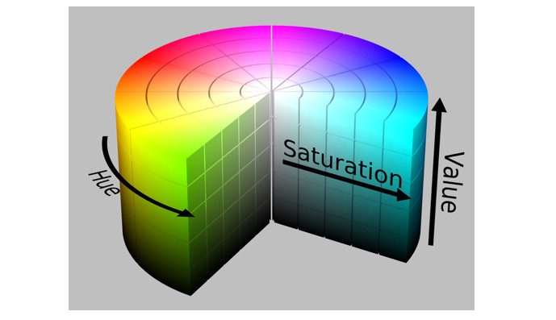

Hôm nay, sẽ đi khám phá thế giới hệ màu trong ảnh số. Khá là thú vị đấy.

## 1. Khởi đầu tưởng chừng đơn giản: RGB

Chúng ta có 3 cái đèn pin màu: đỏ, xanh lá và xanh lam (blue). Cả 3 cùng chiếu vào một điểm trên tường. Càng tăng cường độ của đèn nào thì màu đó càng rõ. Nếu bật cả 3 đèn với cùng công suất sẽ có được màu trắng. Tắt hết thì có màu đen. Vậy đó, vừa tạo ra hệ màu RGB, đây là hệ màu phổ biến và cơ bản nhất, hệ màu mà mọi người và mọi màn hình đều thích. 

Trong máy tính, RGB được lưu trữ dưới dạng 3 kênh (channels), mỗi kênh có giá trị từ 0 đến 255 (với ảnh là 8 bit). 

**RGB** rất trực quan cho con người, nhưng lại là một cơn ác mộng cho bài toán xử lý ảnh. Tại sao??? 

- Tính tương quan cao: trong RGB, các kênh liên quan chặt chẽ với nhau. Nếu độ sáng thay đổi thì cả 3 giá trị R,G,B đều thay đổi. Điều này khiến các thuật toán phân đoạn hay nhận dạng đối tượng bị loạn vì không biết đâu là sự thay đổi về màu sắc, đâu là thay đổi về ánh sáng.
- Không tách biệt độ sáng và màu sắc: Màu vàng của quả chuối và màu vàng của ánh đèn đường có thể có cùng giá trị RGB, nhưng khác nhau về độ sáng. RGB không cho ta thấy điều này rõ ràng.

## 2. Bước vào thế giới “như con người cảm nhận”: HSV

Nếu RGB là ngôn ngữ của máy móc thì  **HSV (Hue - Saturation - Value)** là ngôn ngữ của cảm xúc. Ta biết màu sắc bao gồm sắc độ (Hue), độ bão hoà ( Saturation) và độ sáng tối (Value).



- Hue: thể hiện màu gốc, như đỏ, cam , vàng,… Đại diện bởi một góc trên vòng trong màu.
- Saturation (độ bão hoà): độ tinh khiết của màu sắc. Bão hoà cao = màu nguyên chất, rực rỡ. Bão hoà thấp = màu phai, nhạt.
- Value: Độ sáng tối của màu.

**Sức mạnh của HSV trong xử lý ảnh:**

- Tách bạch màu sắc và độ sáng: khi muốn tìm quả bóng màu đỏ trong một bức ảnh, ta chỉ cần lọc theo kênh Hue. Ánh sáng thay đổi, bóng đổ hay vệt nắng vàng không làm ảnh hưởng đến kênh Hue. Oke đấy

Nghĩ đến việc phân loại các loại trái cây trong một siêu thị. Một trái táo đỏ và một trái ớt đỏ. RGB sẽ thấy chúng khá giống nhau về độ sáng, nhưng HSV sẽ dễ dàng tách vì vùng Hue của chúng khác biệt. Hay như bài toán phát hiện làn đường trên xe tự lái, họ thường chuyển ảnh sang HSV để dễ dàng nhận diện màu vàng (làn đường) bất chấp trời nắng hay râm.

Bí kíp của dân CV:  khi làm việc với openCV, nhớ rằng Hue được chia về thang 0-179 thay vì 0-360. Vì OpenCv dùng kiểu uint8 để tiết kiệm bộ nhớ. Với đỏ, sẽ phải lọc hai khoảng Hue: (0-10) và (160-179). 

**Khi nào dùng HSV??** 

ví dụ như khi làm các tác vụ như: nhận dạng đối tượng theo màu, phân đoạn đối tượng, lọc ảnh theo màu sắc, hoặc bất kì việc gì mà thuộc tính màu sắc là quan trọng nhất.

### 3. Hệ màu LAB

Hệ màu này được thiết kế để gần giống bới cách con người nhìn nhận màu sắc nhất. Nó dựa trên các nghiên cứu tâm lý học thị giác. Một sự thay đổi nhỏ trong giá trị LAB sẽ tương ứng với một sự thay đổi nhỏ về màu sắc mà mắt người có thể cảm nhận được, không phụ thuộc vào màu đó là xanh hay đỏ.

- Kênh L (Lightness): Độ sáng, từ đen (0) đến trắng (255)
- Kênh a: Giá trị từ xanh lá (-) đến đỏ (+).
- Kênh b: Giá trị từ xanh lam (-) đến vàng (+).


**Lab là vũ khí bí mật trong các bài toán:**

- So sánh màu sắc chính xác: Khi cần tính khoảng cách giữa hai màu, sửu dụng không gian LAB cho kết quả gần nhất với cảm nhận của mắt người. Cái này rất hữu ích trong tìm kiếm ảnh theo nội dung.
- Xử lý ảnh nâng cao: Tách riêng kênh L (độ sáng) ra khỏi màu sắc. Ta có thể áp dụng các thuật toán nâng cao nhất lượng ảnh như cần bằng histogram lên kênh L mà không làm thay đổi màu sắc.

## Nhớ lấy

| **Hệ Màu** | **Khi nào dùng?** | **Tuyệt đối đừng dùng khi...** |
| --- | --- | --- |
| 🟥 **RGB** | Hiển thị ảnh, lưu trữ ảnh, các phép toán cơ bản trên điểm ảnh. | Làm các bài toán nhận dạng đối tượng theo màu hoặc khi ánh sáng thay đổi. |
| 🎨 **HSV** | Phân đoạn, trích xuất đối tượng theo màu sắc, đếm đối tượng màu. | Khi bạn cần so sánh sự giống nhau về màu sắc một cách chính xác tuyệt đối (vì Hue là góc tròn, có điểm nhảy từ 179 về 0). |
| 🔬 **LAB** | So sánh, phân cụm màu sắc, các thuật toán nâng cao chất lượng ảnh, AI/Deep Learning nâng cao. | Các bài toán đơn giản, yêu cầu tốc độ thực thi nhanh (vì chuyển đổi LAB tốn tài nguyên). |

## Code chuyển đổi RGB sang các hệ khác, và ngược lại

```python
# RGB 2 HSV 
cv2.cvtColor(img, cv2.COLOR_BGR2HSV)

# HSV 2 RGB
cv2.cvtColor(img, cv2.COLOR_HSV2BGR)

# RGB 2 LAB 
cv2.cvtColor(img, cv2.COLOR_BGR2LAB)

# LAB 2 RGB
cv2.cvtColor(img, cv2.COLOR_LAB2BGR)
```

## Tài liệu tham khảo

1. [https://maydochuyendung.com/tin-tuc/do-dac-chinh-xac/l-a-b-la-gi-nguyen-ly-ung-dung-cua-phuong-phap-do-mau-lab](https://maydochuyendung.com/tin-tuc/do-dac-chinh-xac/l-a-b-la-gi-nguyen-ly-ung-dung-cua-phuong-phap-do-mau-lab)