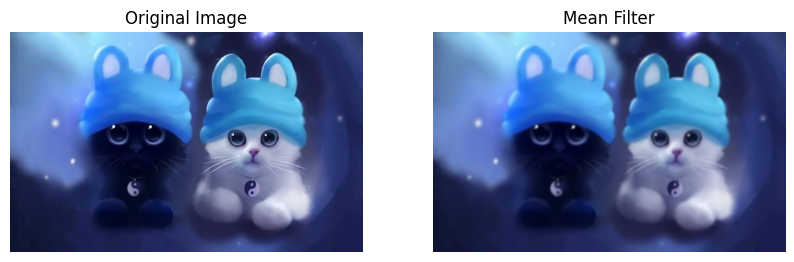

Trong lĩnh vực thị giác máy tính (Computer Vision), ảnh thu nhận từ camera hoặc cảm biến thường bị ảnh hưởng bởi nhiều loại nhiễu khác nhau như nhiễu Gauss, nhiễu muối tiêu (salt-and-pepper), nhiễu Poisson, nhiễu tuần hoàn, v.v. Nhiễu làm giảm chất lượng ảnh, gây khó khăn cho các bước xử lý tiếp theo như phân đoạn, nhận dạng, trích xuất đặc trưng. Do đó, loại bỏ nhiễu và phục hồi ảnh là bước tiền xử lý quan trọng.

Các phương pháp khử nhiễu có thể được chia thành ba nhóm chính:

- **Lọc không gian (spatial filtering):** Tác động trực tiếp lên giá trị pixel dựa trên lân cận (mean, median, Gaussian, max/min, midpoint, non-local means...).
- **Lọc trong miền tần số (frequency domain filtering):** Biến đổi ảnh sang miền tần số (thường dùng Fourier), loại bỏ các thành phần tần số không mong muốn rồi biến đổi ngược.
- **Phương pháp dựa trên biến đổi (transform-based methods):** Sử dụng các biến đổi như Wavelet để tách nhiễu khỏi tín hiệu.

## Các phương pháp

### 1. Mean Filter

Mean filter là bộ lọc tuyến tính, thay thế các giá trị pixel bằng giá trị trung bình cộng của tất cả các pixel trong cửa sổ lân cận.

**Ưu điểm:** Đơn giản, nhanh, giảm nhiễu Gauss nhẹ.

**Nhược điểm:** Làm mờ cạnh, kém hiệu quả với nhiễu xung.

**Ứng dụng:** Tiền xử lý khi yêu cầu giảm nhiễu nhẹ.

**Code:**

```python
import cv2 
import matplotlib.pyplot as plt

img = cv2.imread("/content/images.jpg") 
img = cv2.cvtColor(img, cv2.COLOR_BGR2RGB) 

filtered_image = cv2.medianBlur(img, 5)

plt.figure(figsize=(10, 5))

plt.subplot(1, 2, 1)
plt.imshow(img)
plt.title("Original Image")
plt.axis('off')

plt.subplot(1, 2, 2)
plt.imshow(filtered_image)
plt.title("Mean Filter")
plt.axis('off')

plt.show()
```



- Thay thế giá trị điểm ảnh trung tâm bằng trung bình có trọng số, trong đó trọng số đó giảm dần theo hàm phân phối chuẩn tính từ tâm ra các pixel xung quanh.
- Ứng dụng: dùng nhiều trong bước tiền xử lý trước khi trích xuất biên hoặc chạy mạng neural vì nó làm mờ tự nhiên hơn bộ lọc trung bình và giữ lại cấu trúc mượt mà hơn.

### 2. Median Filter

Median filter là bộ lọc phi tuyến dựa trên thứ tự, thay giá trị pixel trung tâm bằng **trung vị** của các giá trị pixel trong cửa sổ.

**Cơ chế:** sắp xếp các giá trị trong cửa sổ, lấy giá trị chính giữa.

**Ưu điểm:** Rất hiệu quả loại bỏ nhiễu xung, bảo toàn biên tốt.

**Nhược điểm:** Tính toán chậm, giảm nhiễu Gauss kém.

**Ứng dụng:** Loại bỏ nhiễu muối tiêu, ảnh y sinh, vệ tinh.

```python
img = cv2.imread("/content/image1.jpg") 
img = cv2.cvtColor(img, cv2.COLOR_BGR2RGB) 

filtered_image = cv2.medianBlur(img, 5)

plt.figure(figsize=(10, 5))

plt.subplot(1, 2, 1)
plt.imshow(img)
plt.title("Original Image")
plt.axis('off')

plt.subplot(1, 2, 2)
plt.imshow(filtered_image)
plt.title("Median Filter")
plt.axis('off')

plt.show()
```


### 3. Max-Min Filter

Gồm hai bộ lọc: Max (lấy giá trị lớn nhất) và Min (lấy giá trị nhỏ nhất) trong cửa sổ.

**Tác dụng:**

- Max filter loại bỏ nhiễu “tiêu” (điểm tối), làm ảnh sáng lên.
- Min filter loại bỏ nhiễu “muối” (điểm sáng), làm ảnh tối đi.

**Ưu điểm:** Nhanh, hiệu quả với nhiễu xung đơn cực.

**Nhược điểm:** Thay đổi độ sáng tổng thể, không xử lý được nhiễu hỗn hợp.

**Ứng dụng:** Xử lý nhiễu xung đơn loại, tương đương phép giãn nở/co trong morphology.

```python
def max_filter_opencv(image, kernel_size=3):
    kernel = np.ones((kernel_size, kernel_size), dtype=np.uint8)
    if len(image.shape) == 3:
        channels = cv2.split(image)
        result_channels = [cv2.dilate(ch, kernel) for ch in channels]
        return cv2.merge(result_channels)
    else:
        return cv2.dilate(image, kernel)

def min_filter_opencv(image, kernel_size=3):
    kernel = np.ones((kernel_size, kernel_size), dtype=np.uint8)
    if len(image.shape) == 3:
        channels = cv2.split(image)
        result_channels = [cv2.erode(ch, kernel) for ch in channels]
        return cv2.merge(result_channels)
    else:
        return cv2.erode(image, kernel)

img = cv2.imread('image1.jpg')
img_min = min_filter_opencv(img, 3)
img_max = max_filter_opencv(img,3)  
img_combined = max_filter_opencv(min_filter_opencv(img, 3), 3)

img_rgb = cv2.cvtColor(img, cv2.COLOR_BGR2RGB)
img_max_rgb = cv2.cvtColor(img_max, cv2.COLOR_BGR2RGB)
img_min_rgb = cv2.cvtColor(img_min, cv2.COLOR_BGR2RGB)
img_combined_rgb = cv2.cvtColor(img_combined, cv2.COLOR_BGR2RGB)

# Vẽ subplot
plt.figure(figsize=(15, 10))
plt.subplot(2, 2, 1)
plt.imshow(img_rgb)
plt.title("Original Image")
plt.axis('off')

plt.subplot(2, 2, 2)
plt.imshow(img_max_rgb)
plt.title("Max Filter (removes pepper)")
plt.axis('off')

plt.subplot(2, 2, 3)
plt.imshow(img_min_rgb)
plt.title("Min Filter (removes salt)")
plt.axis('off')

plt.subplot(2, 2, 4)
plt.imshow(img_combined_rgb)
plt.title("Combined (Min + Max)")
plt.axis('off')

plt.tight_layout()
plt.show()
```


### **4. Lọc gaussian**

Bộ lọc tuyến tính dùng kernel có trọng số tuân theo phân bố Gauss, giảm dần theo khoảng cách đến tâm.

**Công thức:**

$$
G(x, y) = \frac{1}{2\pi\sigma^2} \exp\left( -\frac{x^2 + y^2}{2\sigma^2} \right)
$$

```python
def Gausskernel(l=5, sig=1.5): 
	s = round((l-1)/2)
	ax = np.linspace(-s,s,l)
	gauss = np.exp(-np.square(ax) / (2*(sig**2)))
	kernel = np.outer(gauss,gauss)
	return kernel/np.sum(kernel)
```

```python
image = cv2.imread('image1.jpg')
image_rgb = cv2.cvtColor(image, cv2.COLOR_BGR2RGB)
gaussian_blurred = cv2.GaussianBlur(image_rgb, (5,5), sigmaX=0) 

plt.figure(figsize=(10, 5))

plt.subplot(1, 2, 1)
plt.imshow(image)
plt.title("Original Image")
plt.axis('off')

plt.subplot(1, 2, 2)
plt.imshow(gaussian_blurred)
plt.title("Gaussian Filter")
plt.axis('off')

plt.show()
```


### 5. Midpoint Filter

Bộ lọc phi tuyến thay thế pixel trung tâm bằng **trung bình cộng của giá trị lớn nhất và nhỏ nhất** trong cửa sổ.

**Ưu điểm:** Loại bỏ cả nhiễu muối và tiêu, xử lý tốt nhiễu phân bố đều.

**Nhược điểm:** Kém hơn median với nhiễu biên độ lớn, không bảo toàn biên tốt.

**Ứng dụng:** Khử nhiễu hỗn hợp nhẹ.

```python
def midpoint_filter_opencv(image, kernel_size=3):
    kernel = np.ones((kernel_size, kernel_size), dtype=np.uint8)
    
    if len(image.shape) == 3 and image.shape[2] == 3:
        # Tách kênh để xử lý độc lập
        channels = cv2.split(image)
        result_channels = []
        for ch in channels:
            max_img = cv2.dilate(ch, kernel)
            min_img = cv2.erode(ch, kernel)
            mid = ((max_img.astype(np.float32) + min_img.astype(np.float32)) / 2).astype(np.uint8)
            result_channels.append(mid)
        return cv2.merge(result_channels)
    else:
        # Ảnh Grayscale
        max_img = cv2.dilate(image, kernel)
        min_img = cv2.erode(image, kernel)
        return ((max_img.astype(np.float32) + min_img.astype(np.float32)) / 2).astype(np.uint8)

image = cv2.imread('images.jpg')
image_rgb = cv2.cvtColor(image, cv2.COLOR_BGR2RGB)
gaussian_blurred = midpoint_filter_opencv(image_rgb, 3) 

plt.figure(figsize=(10, 5))

plt.subplot(1, 2, 1)
plt.imshow(image_rgb)
plt.title("Original Image")
plt.axis('off')

plt.subplot(1, 2, 2)
plt.imshow(gaussian_blurred)
plt.title("Midpoint Filter")
plt.axis('off')

plt.show()
```

### **6. Phục hồi trong miền tần số**

#### 6.1. Biến đổi Fourier và ý nghĩa tần số

Biến đổi Fourier rời rạc 2D (DFT) chuyển ảnh từ miền không gian sang miền tần số. Trong miền tần số:

- Thành phần tần số thấp tương ứng với các vùng mịn, biến đổi chậm.
- Thành phần tần số cao tương ứng với cạnh, chi tiết nhỏ, và nhiễu ngẫu nhiên.
- Nhiễu tuần hoàn xuất hiện dưới dạng các đốm sáng tại các tần số cụ thể.

Ta có thể thiết kế bộ lọc  $H(u,v)$ nhân với phổ $F(u,v)$ của ảnh để đạt được mục đích, sau đó biến đổi ngược IDFT để thu ảnh kết quả.

#### 6.2. **Lowpass Filter (Lọc thông thấp)**

**Mục đích:** Giữ lại tần số thấp, loại bỏ tần số cao (nhiễu, chi tiết nhỏ) → làm mờ ảnh.

**Các loại bộ lọc thông thấp lý tưởng:** 

1. **Ideal Lowpass Filter (ILPF):**

$$
H(u,v) =   \begin{cases}  1 & \text{nếu } D(u,v) \le D_0 \\  0 & \text{nếu } D(u,v) > D_0  \end{cases}
$$

Với $D(u,v) = \sqrt{u^2 + v^2}$  là khoảng cách từ tâm. Nhược điểm: gây ra hiện tượng ringing (vân) do cắt đột ngột trong miền tần số.

```python
import cv2
import numpy as np
import matplotlib.pyplot as plt

img = cv2.imread('images.jpg', cv2.IMREAD_GRAYSCALE)

# --- Tạo mặt nạ ILPF ---
D0 = 30                           # tần số cắt
rows, cols = img.shape
crow, ccol = rows//2, cols//2
u = np.arange(cols) - ccol
v = np.arange(rows) - crow
U, V = np.meshgrid(u, v)
D = np.sqrt(U**2 + V**2)

H = np.zeros_like(img, dtype=np.float32)
H[D <= D0] = 1.0                  # giữ lại tần số thấp

# --- Áp dụng lọc trong miền tần số ---
f = np.fft.fft2(img)               # FFT 2D
fshift = np.fft.fftshift(f)        # dịch tần số thấp về trung tâm
f_filtered = fshift * H            # nhân phổ với mặt nạ
f_ishift = np.fft.ifftshift(f_filtered)   # dịch ngược lại
img_filtered = np.fft.ifft2(f_ishift)      # biến đổi ngược
img_filtered = np.abs(img_filtered).astype(np.uint8)

# --- Hiển thị ---
plt.figure(figsize=(12, 4))
plt.subplot(1, 3, 1); plt.imshow(img, cmap='gray'); plt.title('Original'); plt.axis('off')
plt.subplot(1, 3, 2); plt.imshow(H, cmap='gray'); plt.title('ILPF Mask'); plt.axis('off')
plt.subplot(1, 3, 3); plt.imshow(img_filtered, cmap='gray'); plt.title(f'ILPF (D0={D0})'); plt.axis('off')
plt.tight_layout()
plt.show()
```


1. **Gaussian Lowpass Filter (GLPF):**

$$
  H(u,v) = e^{-D^2(u,v) / (2D_0^2)}
$$

Không gây ringing, làm mờ mượt, được dùng phổ biến.

**Lưu ý:** Sau khi lọc thông thấp, ảnh bị mất chi tiết cao tần, do đó thường dùng để giảm nhiễu hoặc làm mịn trước khi phân tích.

```python
import cv2
import numpy as np
import matplotlib.pyplot as plt

img = cv2.imread('image1.jpg', cv2.IMREAD_GRAYSCALE)

D0 = 30
rows, cols = img.shape
crow, ccol = rows//2, cols//2
u = np.arange(cols) - ccol
v = np.arange(rows) - crow
U, V = np.meshgrid(u, v)
D = np.sqrt(U**2 + V**2)

H = np.exp(-D**2 / (2 * D0**2))   # công thức Gauss

# --- Áp dụng lọc ---
f = np.fft.fft2(img)
fshift = np.fft.fftshift(f)
f_filtered = fshift * H
f_ishift = np.fft.ifftshift(f_filtered)
img_filtered = np.fft.ifft2(f_ishift)
img_filtered = np.abs(img_filtered).astype(np.uint8)

# --- Hiển thị ---
plt.figure(figsize=(12, 4))
plt.subplot(1, 3, 1); plt.imshow(img, cmap='gray'); plt.title('Original'); plt.axis('off')
plt.subplot(1, 3, 2); plt.imshow(H, cmap='gray'); plt.title('GLPF Mask'); plt.axis('off')
plt.subplot(1, 3, 3); plt.imshow(img_filtered, cmap='gray'); plt.title(f'GLPF (D0={D0})'); plt.axis('off')
plt.tight_layout()
plt.show()
```


1. **Butterworth Lowpass Filter (BLPF):**

$$
  H(u,v) = \frac{1}{1 + \left( \frac{D(u,v)}{D_0} \right)^{2n}}
$$

Bậc $n$ điều khiển độ dốc: $n$ càng lớn càng gần với ideal, nhưng vẫn có ringing nhẹ ở bậc cao. Bậc 1 hoặc 2 thường dùng, không có ringing đáng kể.

```
import cv2
import numpy as np
import matplotlib.pyplot as plt

# Đọc ảnh (nếu không có thì tạo ảnh mẫu)
img = cv2.imread('image1.jpg', cv2.IMREAD_GRAYSCALE)
# Tạo mặt nạ BLPF (bậc 2)
D0 = 30
n = 2                               # bậc của bộ lọc
rows, cols = img.shape
crow, ccol = rows//2, cols//2
u = np.arange(cols) - ccol
v = np.arange(rows) - crow
U, V = np.meshgrid(u, v)
D = np.sqrt(U**2 + V**2)

H = 1 / (1 + (D / (D0 + 1e-8)) ** (2 * n))

# --- Áp dụng lọc ---
f = np.fft.fft2(img)
fshift = np.fft.fftshift(f)
f_filtered = fshift * H
f_ishift = np.fft.ifftshift(f_filtered)
img_filtered = np.fft.ifft2(f_ishift)
img_filtered = np.abs(img_filtered).astype(np.uint8)

# --- Hiển thị ---
plt.figure(figsize=(12, 4))
plt.subplot(1, 3, 1); plt.imshow(img, cmap='gray'); plt.title('Original'); plt.axis('off')
plt.subplot(1, 3, 2); plt.imshow(H, cmap='gray'); plt.title('BLPF Mask'); plt.axis('off')
plt.subplot(1, 3, 3); plt.imshow(img_filtered, cmap='gray'); plt.title(f'BLPF (D0={D0}, n={n})'); plt.axis('off')
plt.tight_layout()
plt.show()
```


#### 6.3. Highpass Filter

**Mục đích:** Giữ lại tần số cao, loại bỏ tần số thấp → làm nổi bật cạnh, chi tiết. Đôi khi dùng để loại bỏ nền không đồng đều.

**Các loại tương tự:** Ideal, Butterworth, Gaussian highpass, được định nghĩa là $H_{\text{HP}}(u,v) = 1 - H_{\text{LP}}(u,v)$.

**Gaussian Highpass:**

$$
  H(u,v) = 1 - e^{-D^2(u,v) / (2D_0^2)}
$$

**Hạn chế:** Highpass filter có xu hướng khuếch đại nhiễu tần số cao. Để khắc phục, người ta dùng **high-boost filtering**:

$$
H_{\text{HB}} = (A - 1) + H_{\text{HP}} 
$$

với $A \ge 1$, giúp tăng cường cạnh mà vẫn giữ được nền.

```python
import cv2
import numpy as np
import matplotlib.pyplot as plt

img = cv2.imread('images.jpg', cv2.IMREAD_GRAYSCALE)

# -------------------- Tạo mặt nạ Gaussian Highpass --------------------
D0 = 30   
rows, cols = img.shape
crow, ccol = rows // 2, cols // 2

# Tạo lưới tọa độ trong miền tần số
u = np.arange(cols) - ccol
v = np.arange(rows) - crow
U, V = np.meshgrid(u, v)
D = np.sqrt(U**2 + V**2)

# Công thức Highpass Gaussian: H = 1 - exp(-D^2 / (2*D0^2))
H_hp = 1 - np.exp(-(D**2) / (2 * (D0**2)))

# -------------------- Áp dụng lọc --------------------
f = np.fft.fft2(img)
fshift = np.fft.fftshift(f)
f_filtered = fshift * H_hp
f_ishift = np.fft.ifftshift(f_filtered)
img_filtered = np.fft.ifft2(f_ishift)
img_filtered = np.abs(img_filtered).astype(np.uint8)

# -------------------- Hiển thị kết quả --------------------
plt.figure(figsize=(15, 5))

plt.subplot(1, 4, 1)
plt.imshow(img, cmap='gray')
plt.title("1. Original Image")
plt.axis('off')

plt.subplot(1, 4, 2)
plt.imshow(H_hp, cmap='gray')
plt.title("2. Highpass Mask (Gaussian)")
plt.axis('off')

plt.subplot(1, 4, 3)
plt.imshow(img_filtered, cmap='gray')
plt.title(f"3. Highpass Result (D0={D0})\n(Edges stand out, background lost)")
plt.axis('off')

# Hiển thị phổ tần số để thấy vùng trung tâm bị chặn
f_mag = np.log(np.abs(fshift) + 1)
plt.subplot(1, 4, 4)
plt.imshow(f_mag, cmap='gray')
plt.title("4. Frequency Spectrum\n(center is blocked)")
plt.axis('off')

plt.tight_layout()
plt.show()
```


## Tài liệu tham khảo

1. Rafael Gonzalez, Digital Image Processing (4th)