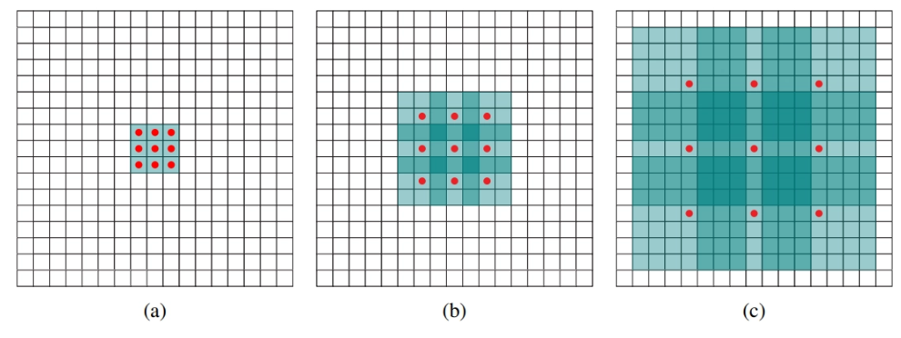

Semantic segmentation là bài toán gán nhãn cho từng điểm trong ảnh. Nó khó vì phải cân bằng hai yêu cầu trái ngược là vừa phải xác định chính xác đường viền của vật thể, vừa phải hiểu được bối cảnh xung quanh ở nhiều kích cỡ để biết vật đó là gì. Bài toán này vừa đòi hỏi tính cục bộ và cả tính tổng thể. 

Một bước đột phá ban đầu là dùng mạng nơ-ron tích chập vốn được thiết kế để phân loại ảnh, nhưng biến đổi nó thành công cụ dự đoán từng pixel bằng cách bỏ các lớp fully connected, thay bằng lớp tích chập 1x1 và tăng mẫu. 

Trước đây có 2 cách tiếp cận nhưng đều có nhược điểm: 

1. Dùng up-convolution: co ảnh nhỏ lại để nhìn rộng, rồi phóng to lên. Cách này làm mất thông tin chi tiết không thể lấy lại được 
2. Dùng nhiều ảnh với những kích cỡ khác nhau: việc này rất tốn kém tài nguyên tính toán. 

Giải pháp được đề xuất là sử dụng **tích chập giãn nở,** tên tiếng anh là dilated convolution. Kỹ thuật này giúp tăng vùng quan sát của mạng lên rất lớn mà không cần co nhỏ ảnh, đồng thời cũng không cần phải xử lý nhiều ảnh. Với một lần chạy duy nhất, mạng vừa giữ nguyên độ nét để lấy chi tiết, vừa có đủ tầm nhìn bao quát để nắm ngữ cảnh.

## Dilated Convolution

Trước tiên, để có góc nhìn trực quan và dễ hình dung hơn ta xem ảnh này: 



Ta thấy ảnh a là kernel tích chập mà ta thường xuyên sử dụng tức là quét qua các pixel sát nhau. Với dilated convolution, có thể cho nó nhảy cóc qua các ô, bỏ qua một vài pixel ở giữa. Việc này khiến cho cùng một bộ lọc 3x3 có thể quét một vùng rộng hơn nhiều (hình b,c).  

## Công thức rút gọn:

1. Tích chập thường:  $s = p - t$ (lấy pixel ngay cạnh)
2. Tích chập giãn nở: $s= p - l*t$ (bước nhảy gấp $l$ lần) 

Với $l=1$ thì nó trở thành tích chập thường, với $l=2$, mỗi bước nhảy cách một ô trống. Cứ thế, ta mở rộng vùng quan sát mà không hề co nhỏ ảnh.  Số ô bỏ trống $=l - 1$.

## Vùng nhìn tăng rất nhanh chỉ sau vài lớp

Khi xếp chồng nhiều lớp tích chập giãn nở với hệ số tăng dần (1,2,4,8,…), vùng nhìn (tiếng anh là receptive field) của mạng sẽ tăng theo cấp số nhân. Chỉ với 3 lớp 3x3, vùng nhìn nhảy từ  $3x3 → 7x7 → 15x15$.

Kích thước vùng nhìn ở tầng $i+1$ được tính chính xác bằng: $(2^{i+2} - 1) \times (2^{i+2} - 1)$

| **Tầng ($i+1$)** | **Dilation rate ($2^i$)** | **Kích thước Kernel** | **Receptive Field** |
| :--- | :---: | :---: | :--- |
| Tầng 1 ($i=0$) | $1$ | $3 \times 3$ | $(2^2 - 1) = 3 \rightarrow \mathbf{3 \times 3}$ |
| Tầng 2 ($i=1$) | $2$ | $3 \times 3$ | $(2^3 - 1) = 7 \rightarrow \mathbf{7 \times 7}$ |
| Tầng 3 ($i=2$) | $4$ | $3 \times 3$ | $(2^4 - 1) = 15 \rightarrow \mathbf{15 \times 15}$ |
| Tầng 4 ($i=3$) | $8$ | $3 \times 3$ | $(2^5 - 1) = 31 \rightarrow \mathbf{31 \times 31}$ |

**Kết luận** 

1. Bản chất của dilated convolution không phải là việc nhét thêm các số 0 để tạo ra một bộ lọc lớn hơn trong bộ nhớ máy tính mà là sửa đổi trực tiếp toán tử tích chập để thay đổi bước nhảy lấy mẫu trên feature map. Nhờ đó, cùng một bộ lọc $3 \times 3$ (chỉ tốn đúng 9 trọng số), ta có thể áp dụng nó ở các phạm vi không gian lớn nhỏ tùy ý chỉ bằng cách thay đổi hệ số $l$.
2. **Phá vỡ mâu thuẫn giữa độ phân giải và vùng nhìn:** Trong kiến trúc CNN truyền thống, cách duy nhất để mở rộng vùng nhìn là dùng Pooling/Striding điều này làm giảm kích thước và độ phân giải ảnh, rồi dùng Deconvolution/Upsampling để gượng gạo phục hồi lại. Dilated Convolution cho phép mở rộng vùng nhìn tùy thích mà **giữ nguyên** $100\%$ **độ phân giải** của feature map ở mọi tầng. 
- **Tăng trưởng Receptive Field theo cấp số mũ:** Khi sắp xếp chuỗi tích chập với hệ số giãn nở tăng theo lũy thừa của 2 ($l = 1, 2, 4, 8, \dots$), Receptive Field tăng vọt theo hàm mũ $(2^{i+2}-1) \times (2^{i+2}-1)$. Điều này cho phép mạng bao quát toàn cảnh không gian cực lớn chỉ sau vài tầng

## Code đơn giản

**Code from scratch**

```python
def dilated_conv2d_scratch(F, k, dilation=1):
    H, W = F.shape
    Kh, Kw = k.shape
    
    # Bán kính bộ lọc quanh tâm (0, 0)
    rx = Kh // 2
    ry = Kw // 2
    
    # Padding cần thiết để giữ nguyên độ phân giải không gian: padding = l * r
    pad_h = dilation * rx
    pad_w = dilation * ry
    F_padded = np.pad(F, ((pad_h, pad_h), (pad_w, pad_w)), mode='constant', constant_values=0)
    
    out = np.zeros((H, W), dtype=np.float32)
    
    # Duyệt qua từng pixel p = (x, y) trên ma trận đầu ra
    for x in range(H):
        for y in range(W):
            val = 0.0
            # Duyệt qua từng trọng số của kernel k tại độ lệch t = (tx, ty) quanh tâm
            for tx in range(-rx, rx + 1):
                for ty in range(-ry, ry + 1):
                    # Vị trí lấy mẫu tương ứng trên ảnh có padding:
                    # Tọa độ gốc s = p - l*t, cộng thêm khoảng bù pad_h, pad_w
                    sx = (x + pad_h) - dilation * tx
                    sy = (y + pad_w) - dilation * ty
                    
                    # Trọng số kernel: tx, ty tương ứng chỉ số mảng (tx + rx, ty + ry)
                    weight = k[tx + rx, ty + ry]
                    val += F_padded[sx, sy] * weight
                    
            out[x, y] = val
            
    return out
```

**Code theo pytorch:**

```python
conv = nn.Conv2d(in_channels, out_channels, kernel_size=3, 
                 padding=dilation, dilation=dilation)
out = conv(x)
```

## Ứng dụng thực tế Context Module

Dựa trên ý tưởng trên, các nhà nghiên cứu đã xây dựng một module có tên là Multi-Scale Context Aggregation. Module này gồm 8 lớp tích chập, với các hệ số giãn nở được sắp xếp theo chuỗi: $1,1,2,4,8,16,1$ và cuối cùng là một lớp 1x1 để xuất kết quả. 

### Phiên bản basic

Nhẹ và giữ nguyên số kênh qua mỗi tầng:

### Phiên bản large

Mạnh hơn, số kênh tăng dần ($2C → 2C → 4C → 8C → 16C → ….→ C$) để học nhiều đặc trưng phức tạp hơn. Khởi tạo phức tạp hơn như nhóm kênh theo từng nhóm, kèm thêm nhiễu nhỏ để phá vỡ tính đối xứng. 

| **Tầng (Layer)** | **1** | **2** | **3** | **4** | **5** | **6** | **7** | **8** |
| :--- | :---: | :---: | :---: | :---: | :---: | :---: | :---: | :---: |
| **Kích thước Kernel** | $3 \times 3$ | $3 \times 3$ | $3 \times 3$ | $3 \times 3$ | $3 \times 3$ | $3 \times 3$ | $3 \times 3$ | $1 \times 1$ |
| **Hệ số giãn nở ($l$)** | $1$ | $1$ | $2$ | $4$ | $8$ | $16$ | $1$ | $1$ |
| **Cắt cụt (ReLU)** | Có | Có | Có | Có | Có | Có | Có | Không |
| **Receptive Field** | $3 \times 3$ | $5 \times 5$ | $9 \times 9$ | $17 \times 17$ | $33 \times 33$ | $65 \times 65$ | $67 \times 67$ | $67 \times 67$ |
| **Kênh ra (Bản Basic)** | $C$ | $C$ | $C$ | $C$ | $C$ | $C$ | $C$ | $C$ |
| **Kênh ra (Bản Large)** | $2C$ | $2C$ | $4C$ | $8C$ | $16C$ | $32C$ | $32C$ | $C$ |

### **Vấn đề khởi tạo của context module**

Hãy tưởng tượng có một mạng nơ-ron đã được huấn luyện tốt để nhận diện vật thể. Giờ gắn thêm một module mới vào giữa mạng đó. Nếu module mới được khởi tạo ngẫu nhiên, nó sẽ **làm nhiễu loạn** các đặc trưng đẹp đẽ mà mạng đã học được, khiến kết quả tệ đi rõ rệt. Vậy làm thế nào để "thả" module mới vào mà không làm hỏng mạng cũ?

**Giải pháp là identity initialization** 

Ý tưởng đơn giản như sau: khởi tạo module mới để ban đầu nó hoạt động như đường truyền thẳng nghĩa là đầu ra giống hệt đầu vào. Sau đó qua quá trình huấn luyện, module sẽ từ từ học thêm các đặc trưng ngữ cảnh mà không làm hỏng những gì đã có. 

1. **Trường hợp đơn giản là cùng số kênh: basic module** 

Khi số kênh đầu vào và đầu ra bằng nhau (đều là `C`), ta khởi tạo kernel như sau:

$$
k^b(t, a) = 1_{[t=0]} \, 1_{[a=b]}
$$

Trong đó: 

- $a$: Chỉ số kênh đầu vào ($a \in \{1, \dots, C\}$).
- $b$: Chỉ số kênh đầu ra ($b \in \{1, \dots, C\}$).
- $t$: Tọa độ không gian tương đối trên kernel đối xứng quanh tâm ($\bold{t = 0}$ tương ứng với tâm kernel).
- $1_{[\cdot]}$: Hàm chỉ thị logic (bằng 1 nếu điều kiện thỏa mãn, bằng 0 nếu ngược lại).

Tương đương như sau:

- Chỉ có kết nối ở vị trí tâm của kernel
- Kênh đầu ra $b$ chỉ kết nối với đúng đầu vào $a$ nếu $a=b$
- Tất cả các vị trí khác đều bằng 0

**Kết quả:** Module ban đầu là một đường thẳng, dữ liệu đi qua mà không bị thay đổi. Sau đó, quá trình học sẽ từ từ bật thêm các kết nối khác để mở rộng ngữ cảnh.

1. **Trường hợp phức tạp là số kênh thay đổi: large module**

**Giải pháp khởi tạo cho large module**

- **Khởi tạo tổng quát**
Do số kênh ở hai tầng liên tiếp không còn bằng nhau ($c_i$ kênh tầng trước và $c_{i+1}$ kênh tầng sau), phép gán $a = b$ không còn khả dụng. Với giả định $C$ chia hết cho cả $c_i$ và $c_{i+1}$, phương pháp khởi tạo được tổng quát hóa:

$$
k^b(t, a) = \begin{cases}  \frac{C}{c_{i+1}} & \text{khi } t = 0 \text{ và } \lfloor \frac{aC}{c_i} \rfloor = \lfloor \frac{bC}{c_{i+1}} \rfloor \\ \epsilon & \text{trường hợp còn lại} \end{cases}
$$

- Trong đó:
    - $\lfloor \frac{aC}{c_i} \rfloor = \lfloor \frac{bC}{c_{i+1}} \rfloor$: Cơ chế nhóm các kênh. Kênh đầu ra $b$ sẽ kết nối với kênh đầu vào $a$ nếu chúng thuộc về cùng một nhóm lớp gốc trong số $C$ phân lớp.
    - $\frac{C}{c_{i+1}}$: Hệ số tỷ lệ chuẩn hóa biên độ tín hiệu, đảm bảo năng lượng truyền qua các kênh được bảo toàn cân bằng.
    - $\epsilon \sim \mathcal{N}(0, \sigma^2)$ với $\sigma \ll \frac{C}{c_{i+1}}$: Thành phần nhiễu ngẫu nhiên Gauss rất nhỏ.

## Code đầy đủ và trực quan

**Basic Context Module:** 

```python
class ContextModule(nn.Module):
    """Basic Context Module với Identity Initialization"""
    def __init__(self, in_channels, out_channels=None):
        super().__init__()
        if out_channels is None:
            out_channels = in_channels

        dilations = [1, 1, 2, 4, 8, 16, 1]
        self.layers = nn.ModuleList()

        for d in dilations:
            conv = nn.Conv2d(in_channels, in_channels, kernel_size=3,padding=d, dilation=d, bias=False)
            # Khởi tạo identity cho conv 3x3
            self._init_identity_conv3x3(conv, in_channels)
            self.layers.append(nn.Sequential(conv, nn.ReLU(inplace=True)))

        # Conv 1x1 cuối
        self.final_conv = nn.Conv2d(in_channels, out_channels, kernel_size=1, bias=False)
        self._init_identity_conv1x1(self.final_conv, in_channels, out_channels)

    def _init_identity_conv3x3(self, conv, C):
        """Kernel 3x3: chỉ giữ ô tâm = 1, a=b"""
        with torch.no_grad():
            conv.weight.data.zero_()
            for i in range(C):
                conv.weight.data[i, i, 1, 1] = 1.0

    def _init_identity_conv1x1(self, conv, in_ch, out_ch):
        """Kernel 1x1: ma trận đơn vị (nếu in_ch == out_ch) hoặc ánh xạ nếu khác"""
        with torch.no_grad():
            conv.weight.data.zero_()
            if in_ch == out_ch:
                for i in range(in_ch):
                    conv.weight.data[i, i, 0, 0] = 1.0
            else:
                # Trường hợp số kênh khác nhau: có thể dùng cách nhóm (phức tạp hơn)
                # Hoặc đặt một số kết nối tùy chọn, ở đây tạm để zero
                pass

    def forward(self, x):
        for layer in self.layers:
            x = layer(x)
        x = self.final_conv(x)
        return x
```

**Large context module:** 

```python
def init_identity_conv(conv, in_ch, out_ch, eps=1e-6):
    """
    Khởi tạo identity cho kernel bất kỳ (3x3 hoặc 1x1)
    theo công thức tổng quát cho Large Module.
    
    - conv: lớp nn.Conv2d cần khởi tạo
    - in_ch: số kênh đầu vào
    - out_ch: số kênh đầu ra
    - eps: nhiễu nhỏ cho các kết nối không cùng nhóm (mặc định 1e-6)
    """
    # Chọn C = bội chung nhỏ nhất của in_ch và out_ch
    C = in_ch * out_ch // math.gcd(in_ch, out_ch)
    
    with torch.no_grad():
        weight = conv.weight
        kh, kw = weight.shape[-2:]          # kích thước kernel (cao, rộng)
        center_h, center_w = kh // 2, kw // 2
        
        # Bước 1: Đặt tất cả trọng số = eps (nhiễu nhỏ)
        weight.fill_(eps)
        
        # Bước 2: Với các cặp kênh cùng nhóm, đặt trọng số tại tâm = C / out_ch
        for b in range(out_ch):          # kênh đầu ra
            for a in range(in_ch):       # kênh đầu vào
                if (a * C // in_ch) == (b * C // out_ch):
                    weight[b, a, center_h, center_w] = C / out_ch

class ContextModule(nn.Module):
    """
    Context Module với Identity Initialization.
    Hỗ trợ cả Basic (giữ nguyên số kênh) và Large (tăng kênh dần).
    """
    def __init__(self, C, mode='basic'):
        """
        C: số kênh gốc
        mode: 'basic' hoặc 'large'
        """
        super().__init__()
        
        # Xác định số kênh đầu ra cho từng tầng (8 tầng)
        if mode == 'basic':
            channel_list = [C] * 8          # tất cả đều C
        elif mode == 'large':
            channel_list = [2*C, 2*C, 4*C, 8*C, 16*C, 32*C, 32*C, C]
        else:
            raise ValueError("mode must be 'basic' or 'large'")
        
        dilations = [1, 1, 2, 4, 8, 16, 1]   # 7 tầng đầu (3x3)
        layers = []
        prev_ch = C                           # đầu vào ban đầu là C
        
        # 7 tầng Conv3x3 + ReLU
        for i in range(7):
            out_ch = channel_list[i]
            conv = nn.Conv2d(prev_ch, out_ch, kernel_size=3,
                             padding=dilations[i],
                             dilation=dilations[i],
                             bias=False)
            init_identity_conv(conv, prev_ch, out_ch)
            layers.append(conv)
            layers.append(nn.ReLU(inplace=True))
            prev_ch = out_ch
        
        # Tầng cuối Conv1x1, không ReLU
        out_ch = channel_list[7]
        conv_final = nn.Conv2d(prev_ch, out_ch, kernel_size=1, bias=False)
        init_identity_conv(conv_final, prev_ch, out_ch)
        layers.append(conv_final)
        
        self.net = nn.Sequential(*layers)
    
    def forward(self, x):
        return self.net(x)
```

## Case Study: **Đánh giá UNet + Context Module (Dilated Convolution) trên bài toán phân đoạn**

#### **1. Thiết lập thực nghiệm (Experimental Setup)**

- **Bộ dữ liệu:** ISIC 2018
- **Mô hình so sánh:**
    - **Baseline:** UNet gốc (không có Context Module).
    - **Proposed:** UNet + Basic Context Module.
- **Chi tiết huấn luyện:**
    - Optimizer: Adam, Learning Rate (LR) = `1e-4`.
    - Hàm mất mát (Loss): Kết hợp `DiceLoss` + `BCEWithLogitsLoss`.
    - Batch Size: 16.
    - Epochs: 20, Early Stopping với Patience = 5.

### 6.2. Notebook thực nghiệm

Bạn có thể tải về file notebook mã nguồn thực nghiệm tại đây:

> 📥 **Tải về Jupyter Notebook:** <a href="/blog/multi-scale-context-aggregation/unet_dilated_conv.ipynb" download="unet_dilated_conv.ipynb">**`unet_dilated_conv.ipynb`**</a> (hoặc nhấp chuột phải chọn *Save Link As...*)

### 6.3. Kết quả thực nghiệm

| **Mô hình** | **Dice Coefficient (%)** | **IoU (%)** | **Số tham số (Params)** | **Ghi chú** |
| :--- | :---: | :---: | :---: | :--- |
| **UNet (Baseline)** | 85.4 | 77.5 | **13.3M** | Đối chứng chuẩn |
| **UNet + Basic Context Module** | **88.7** | **81.6** | **23.0M** | Tăng +3.3% Dice, +4.1% IoU |

---

## Tài liệu tham khảo

1. **Yu, F., & Koltun, V. (2016).** *Multi-Scale Context Aggregation by Dilated Convolutions*. ICLR 2016. ([arXiv:1511.07122](https://arxiv.org/abs/1511.07122))
2. **Chen, L. C. et al. (2017).** *DeepLab: Semantic Image Segmentation with Deep Convolutional Nets and Atrous Convolution*. IEEE TPAMI. ([arXiv:1606.00915](https://arxiv.org/abs/1606.00915))