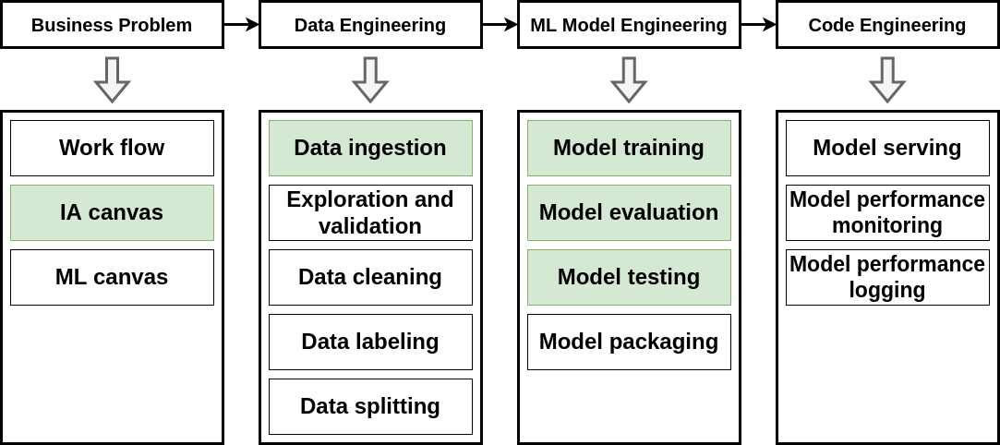
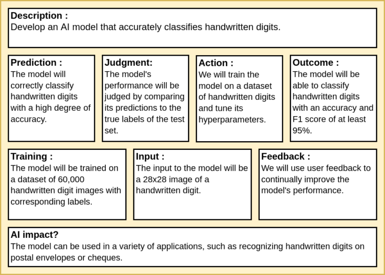
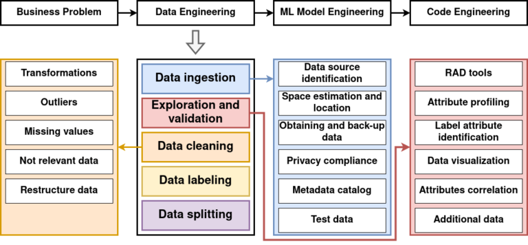
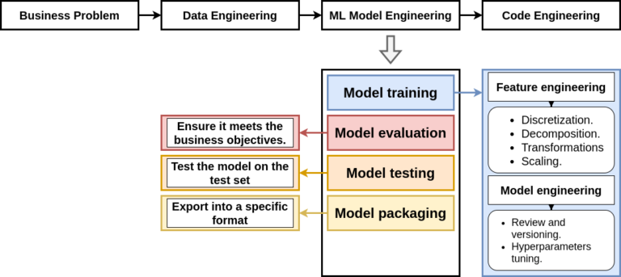
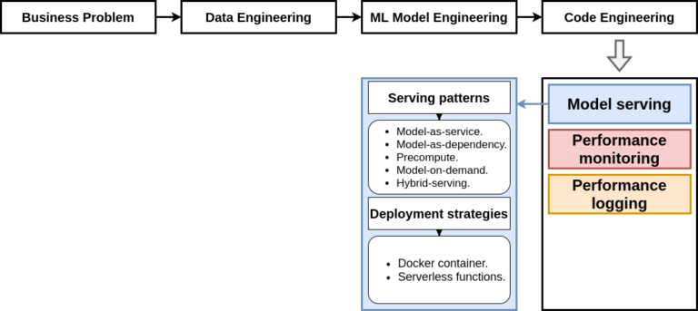
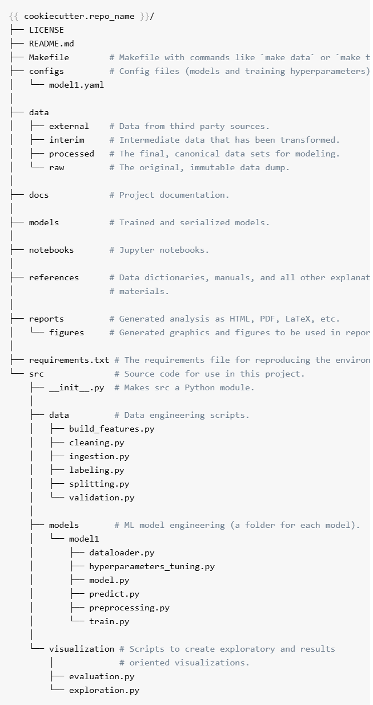

Trong phát triển phần mềm ứng dụng trí tuệ nhân tạo (AI/ML), có một nghịch lý phổ biến: hơn 80% mô hình Machine Learning đạt độ chính xác cao trong môi trường thử nghiệm (Jupyter Notebook) nhưng không bao giờ được đưa lên môi trường thực tế (Production). Lý do chính không nằm ở thuật toán, mà xuất phát từ việc thiếu một quy trình MLOps chuẩn mực và cấu trúc dự án có khả năng mở rộng, bảo trì cao.

---

## Vòng đời MLOps (End-to-End Workflow)

MLOps là sự kết hợp giữa Machine Learning, Data Engineering và DevOps nhằm xây dựng, tự động hóa và duy trì các pipeline AI liên tục, đáng tin cậy.



Một chu trình MLOps hoàn chỉnh bao gồm 4 trụ cột nối tiếp nhau:
1. **Business Problem**: Xác định và mô hình hóa bài toán kinh doanh thành bài toán kỹ thuật.
2. **Data Engineering**: Thu thập, làm sạch, thẩm định và chuẩn bị tập dữ liệu chất lượng cao.
3. **Machine Learning Model Engineering**: Huấn luyện, tinh chỉnh, kiểm thử và đóng gói mô hình.
4. **Code & Serving Engineering**: Xây dựng kiến trúc phục vụ, giám sát và ghi log trong production.

---

## Giai đoạn 1: Định nghĩa Bài toán Kinh doanh

Trước khi đi vào giải quyết vấn đề và huấn luyện mô hình ta phải hiểu rõ tác động kinh doanh và ràng buộc hệ thống.



Để định hình một bài toán khả thi, cần trả lời 5 nhóm câu hỏi cốt lõi:

### 1. Xác định mục tiêu và kết quả đầu ra
- **Description**: Doanh nghiệp đang gặp nút thắt (bottleneck) nào?
- **Outcome**(kết quả thành công về mặt nghiệp vụ): ví dụ như giảm …% thời gian xử lý thủ công và đạt tỉ lệ sai sót dưới …% trong vận hành thực tế đây không phải chỉ số trên test set.
- **Action**: Khi mô hình trả về kết quả dự đoán, hệ thống hoặc nhân sự sẽ làm gì tiếp theo?
### 2. Định nghĩa bài toán Machine Learning
- **Task Type**: Bài toán thuộc dạng nào? (Classification, Regression, Ranking, Object Detection, Time-series Forecasting...).
- **Prediction**: Biến mục tiêu cần dự đoán chính xác là gì?
- **Input Data**: Dữ liệu thô đầu vào gồm những trường nào, dạng dữ liệu gì (bảng, hình ảnh, văn bản)?
- **Training**:Mô hình sẽ được trên như nào??
### 3. Đánh giá tính khả thi và thiết lập Baseline
- **Baseline**: Xây dựng giải pháp đơn giản nhất (ví dụ: Rule-based hoặc Logistic Regression) để làm mốc tham chiếu hiệu năng tối thiểu.
- **Constraints**: 
  - Độ trễ suy luận tối đa (Inference Latency SLA: ví dụ $< 50\text{ms}$).
  - Kích thước mô hình (Memory / Disk footprint: ví dụ $< 200\text{MB}$).
  - Tài nguyên phần cứng (CPU vs GPU inference, RAM, băng thông mạng).
### 4. Chiến lược đánh giá và òng lặp Phản hồi
- **Judgement**: dùng chỉ số kỹ thuật nào để biết mô hình tốt ?
- **Feedback**: Cơ chế thu thập dữ liệu mới từ production để phát hiện Data Drift và retrain lại mô hình. 
### 5. Tác động, rủi ro
- **AI Impact**: mô hình có ảnh ưởng thế nào
- **Bias/Fairnes**s: Mô hình có nguy cơ phân biệt đối xử với một nhóm khách hàng cụ thể nào không? Quyết định có cần được giải thích rõ ràng (Explainability) cho người dùng không?
## Giai đoạn 2: Data Engineering

Dữ liệu là nhiên liệu của mọi hệ thống AI, nên trước khi đi vào huấn luyện mô hình thì phải đảm bảo dữ liệu sạch và phù hợp với mô hình. 



Quy trình Data Engineering bao gồm:
### 1. Data Ingestion
- xác định nguồn dữ liệu, ước lượng dung lượng và xác định vị trí lưu
- Thiết lập sao lưu dự phòng, ghi nhận Metadata Catalog (nguồn gốc, schema version, timestamp) và đảm bảo tuân thủ quyền riêng tư (GDPR, HIPAA).
### 2. Exploration and validation 
- Sử dụng các công cụ phân tích (Pandas, Polars,...).
- Phân tích kiểu dữ liệu, phân phối xác suất, khoảng giá trị min/max.
- Phát hiện rò rỉ dữ liệu (Data Leakage) và mối tương quan chéo giữa các đặc trưng.
### 3. Data Cleaning (Làm sạch dữ liệu)
- Xử lý giá trị khuyết thiếu.
- Xử lý giá trị ngoại lai.
- Biến đổi dữ liệu
- Chuẩn hóa kiểu dữ liệu, loại bỏ dữ liệu rác/trùng lặp và biến đổi cấu trúc bảng (Pivot, Unpivot, Join).
### 4. Data Labeling (Gán nhãn)
- Thực hiện gán nhãn thủ công hoặc bán tự động.
### 5. Data Splitting (Phân chia tập dữ liệu)
- Chia tách nghiêm ngặt thành 3 tập: **Train Set**, **Validation Set**, và **Test Set**.
- Sử dụng **Stratified Split** cho dữ liệu mất cân bằng nhãn hoặc **Time-series Split** (Walk-forward) cho dữ liệu chuỗi thời gian để tuyệt đối tránh rò rỉ tương lai (look-ahead bias).

---

## Giai đoạn 3: Huấn luyện và đóng gói mô hình

Model Engineering biến dữ liệu đã làm sạch thành các mô hình toán học tối ưu, sẵn sàng phục vụ cho suy luận.



### 1. Feature Engineering & Preprocessing
- **Biến đổi phân phối**: Dùng Log Transform,... để chuyển dữ liệu lệch về phân phối chuẩn (Gaussian distribution).
- **Mã hóa đặc trưng**: Rời rạc hóa, One-Hot Encoding, Target Encoding, hoặc Text/Image Embeddings.
- **Chuẩn hóa (Feature Scaling)**: Chuẩn hóa dữ liệu về cùng một tỷ lệ.
### 2. Huấn luyện & Quản lý Thí nghiệm (Experiment Tracking)
- Ghi nhận toàn bộ siêu tham số, metrics, artifacts bằng các công cụ chuyên dụng như **MLflow**.
- Tìm kiếm siêu tham số tối ưu bằng Bayesian Optimization hoặc GridSearch, RandomSearch.
### 3. Đánh giá & Kiểm thử Mô hình (Evaluation & Blind Testing)
- **Model Evaluation**: Đánh giá đa chiều trên Validation Set sau mỗi epoch/iteration.
- **Model Testing**: Kiểm thử độc lập lần cuối trên Blind Test Set (tuyệt đối không chạm vào trong quá trình training/tuning).
- **Slice-based & Invariance Testing**: Kiểm tra hiệu năng trên từng nhóm nhỏ (sub-groups) và khả năng chịu nhiễu (Perturbation testing).
### 4. Đóng gói Mô hình (Model Packaging)
- Chuyển đổi mô hình sang các định dạng suy luận tối ưu:
  - **ONNX** (Open Neural Network Exchange): Độc lập nền tảng, tương thích cao.
  - **TorchScript / TensorRT**: Tối ưu hóa sâu trên phần cứng GPU NVIDIA.
  - **OpenVINO**: Tối ưu hóa trên CPU/iGPU Intel.
  - **BentoML / Triton Model Store**: Chuẩn hóa container phục vụ serving quy mô lớn.

---

## Giai đoạn 4: Kiến trúc Triển khai & Vận hành (Code & Serving Engineering)

Sau khi có artifact mô hình tối ưu, bước tiếp theo là đưa mô hình vào kiến trúc phần mềm thực tế để tiếp nhận yêu cầu từ người dùng hoặc hệ thống khác.



### 5 Serving Patterns Cốt lõi Trong Thực Tế

| Serving Pattern                  | Cơ chế hoạt động                                                           | Trường hợp sử dụng phù hợp                                | Ưu / Nhược điểm                                                    |
| :------------------------------- | :------------------------------------------------------------------------- | :-------------------------------------------------------- | :----------------------------------------------------------------- |
| **Model-as-a-Service**           | Mô hình bọc trong REST/gRPC API (FastAPI, Triton, TorchServe).             | Ứng dụng web, microservices cần suy luận real-time.       | ✅ Tách biệt độc lập<br>❌ Độ trễ mạng (Network overhead)            |
| **Model-as-a-Dependency**        | Nhúng trực tiếp runtime model vào code ứng dụng (C++, Wasm, Python lib).   | Ứng dụng di động (Edge AI), IoT, game engines.            | ✅ Siêu nhanh, không cần mạng<br>❌ Khó cập nhật phiên bản           |
| **Precompute / Batch Inference** | Chạy dự đoán định kỳ theo lô (offline batch), lưu kết quả vào DB/Redis.    | Dự đoán điểm tín dụng hàng đêm, gợi ý sản phẩm định kỳ.   | ✅ Rẻ, chịu tải tức thì<br>❌ Không xử lý được dữ liệu mới phát sinh |
| **Model-on-Demand (Streaming)**  | Mô hình lắng nghe trực tiếp từ event stream (Kafka, Kinesis).              | Phát hiện gian lận giao dịch tài chính (Fraud Detection). | ✅ Xử lý real-time trên luồng<br>❌ Đòi hỏi hạ tầng stream phức tạp  |
| **Hybrid Serving**               | Kết hợp Cache/Precompute cho dữ liệu phổ biến + On-demand cho dữ liệu mới. | Hệ thống Recommendation, Search ranking quy mô lớn.       | ✅ Cân bằng tối ưu chi phí & độ trễ<br>❌ Kiến trúc phức tạp         |

### Deployment Strategies & Containerization
- **Docker container**: Đóng gói mã nguồn, model weights, CUDA dependencies thành container image bất biến (immutable).
- **Serverless Inference**: Triển khai mô hình dưới dạng hàm serverless (AWS Lambda, Google Cloud Functions).
### Performance Monitoring & Observability
- **Hạ tầng giám sát**: Prometheus + Grafana theo dõi QPS (Queries per second), Latency (p50, p95, p99), GPU/CPU Memory usage.
- **Giám sát chất lượng AI**:
  - **Data Drift**: Phân phối dữ liệu đầu vào thực tế thay đổi so với dữ liệu huấn luyện (dùng thống kê KS-Test, PSI).
  - **Concept Drift**: Mối quan hệ giữa Input và Target thay đổi theo thời gian.
- **Structured Logging**: Ghi log chi tiết dưới dạng JSON (request_id, input_features, prediction, latency_ms) để phục vụ debug và tái huấn luyện.

---
## Cấu trúc Thư mục Dự án ML/MLOps Chuẩn Thực Chiến

Để đáp ứng toàn bộ các yêu cầu trên, cấu trúc mã nguồn của một dự án Machine Learning chuyên nghiệp cần phân tách rõ ràng trách nhiệm giữa từng tầng:



### Điểm Nhấn Kiến Trúc Quan Trọng

1. **Tách biệt `train.py` và `predict.py`**:
   - `train.py`: Chạy offline theo batch, nhận đầu vào từ dataset lớn, ghi log metrics lên MLflow.
   - `predict.py`: Được thiết kế cho **runtime của ứng dụng**, nhận payload đầu vào trực tiếp từ API request (chưa qua tiền xử lý), thực thi chuẩn hóa và trả về kết quả thời gian thực với độ trễ thấp nhất.

2. **Module hóa `preprocessing.py`**:
   - Đảm bảo **cùng một logic biến đổi** được áp dụng cho cả lúc huấn luyện và lúc suy luận thực tế (ngăn chặn triệt để hiện tượng *Train-Serve Skew*).
   - Nếu dùng chung giữa các model, có thể trừu tượng hóa thành transformer pipeline lưu trong `src/data/build_features.py`.

3. **Tách biệt triệt để Config khỏi Source Code**:
   - Mọi siêu tham số (learning rate, batch size, epochs, đường dẫn dữ liệu) đều được cấu hình trong thư mục `configs/` dưới dạng YAML/JSON, không bao giờ hard-code trực tiếp trong file code Python.

Ví dụ file `configs/train_config.yaml`:

```yaml
experiment_name: "customer_churn_prediction_v2"

data:
  raw_path: "data/raw/customers.csv"
  processed_train_path: "data/processed/train.parquet"
  processed_val_path: "data/processed/val.parquet"
  test_size: 0.2
  random_state: 42

model:
  name: "xgboost_classifier"
  hyperparameters:
    n_estimators: 300
    max_depth: 6
    learning_rate: 0.05
    subsample: 0.8
    colsample_bytree: 0.8
```

---

## Tài liệu tham khảo

1. [Towards Data Science](https://towardsdatascience.com/structuring-your-machine-learning-project-with-mlops-in-mind-41a8d65987c9/)