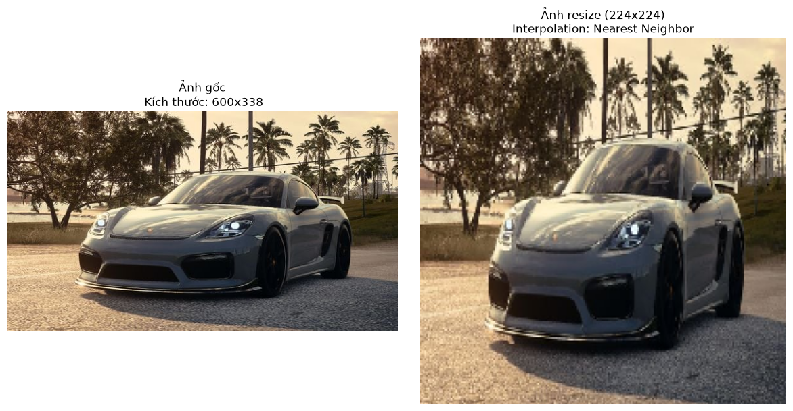

## Thay đổi kích thước ảnh

Là quá trình điều chỉnh số lượng điểm ảnh theo chiều rộng và chiều cao của một bức ảnh. Có thể thu nhỏ hoặc phóng to ảnh. 

Mục đích: 

- Để chuẩn hoá đầu vào, hầu hết các mô hình học sâu yêu cầu các đầu vào có kích thước cố định nên cần phải resize ảnh để đưa dữ liệu vào mô hình.
- Giảm kích thước ảnh giúp giảm dung lượng bộ nhớ và tăng tốc độ tính toán.
- Thu nhỏ ảnh giúp làm mờ các chi tiết nhiễu nhỏ, mô hình tập trung vào các đặc trưng có cấu trúc lớn.

Các phương pháp thực hiện: Khi thay đổi kích thước thì máy phải đoán thêm pixel mới khi phóng to hoặc gộp pixel lại khi thu nhỏ. Thuật toán cần dùng để làm việc này là interpolation. 

- Nearest Neighbor: lấy giá trị của pixel gần nhất. Nhanh nhưng ảnh bị răng cưa, vỡ vụn.
- Bilinear: lấy trung bình trọng số của 4 pixel lân cận.
- Bicubic: lấy trung bình của 16pixel lân cận. Chất lượng tốt hơn bilinear, nhưng chậm hơn.
- Lanczos: dùng toán học phức tạp, cho ảnh sắc nét khi phóng to.

**Ví dụ:** 

1. Resize với interpolation là Nearest Neighbor 

```python
image = cv2.imread("./xe.jpg") 
image_rgb = cv2.cvtColor(image, cv2.COLOR_BGR2RGB) 
resized_image = cv2.resize(image_rgb,(224,224),interpolation=cv2.INTER_NEAREST)
```



1. Resize với interpolation là Bilinear

```python
image = cv2.imread("./xe.jpg") 
image_rgb = cv2.cvtColor(image, cv2.COLOR_BGR2RGB) 
resized_image = cv2.resize(image_rgb,(224,224),interpolation=cv2.INTER_LINEAR)
```


1. Resize với interpolation là Bicubic

```python
image = cv2.imread("./xe.jpg") 
image_rgb = cv2.cvtColor(image, cv2.COLOR_BGR2RGB) 
resized_image = cv2.resize(image_rgb,(224,224),interpolation=cv2.INTER_CUBIC)
```


1. Resize với interpolation là Lanczos

```python
image = cv2.imread("./xe.jpg") 
image_rgb = cv2.cvtColor(image, cv2.COLOR_BGR2RGB) 
resized_image = cv2.resize(image_rgb,(224,224),interpolation=cv2.INTER_LANCZOS4)
```


**Lưu ý khi resize:**

- Nếu đặt chiều rộng và chiều cao theo kích thước cố định mà không giữ tỷ lệ thì ảnh sẽ bị biến dạng. Làm sai lệch hình dạng của vật trong ảnh.
    - Resize giữ tỷ lệ: thay đổi kích thước sao cho cạnh dài nhất bằng kích thước đích, sau đó thêm viền đen vào các cạnh còn lại để tạo hình vuông.
    - Center crop: cắt một hình vuông ở giữa ảnh gốc, sau đó mới resize về kích thước mong muốn.

Ví dụ resize giữ tỷ lệ: 

```python
def resize_with_padding(image, target_size=(224, 224)):
    h, w = image.shape[:2]
    target_w, target_h = target_size
    
    # Tính tỉ lệ co dãn (scale) sao cho ảnh vừa khít 1 cạnh
    scale = min(target_w / w, target_h / h)
    new_w = int(w * scale)
    new_h = int(h * scale)
    
    # Resize ảnh với kích thước mới
    resized = cv2.resize(image, (new_w, new_h), interpolation=cv2.INTER_CUBIC)
    
    # Tạo canvas nền đen (target_size)
    canvas = np.zeros((target_h, target_w, 3), dtype=np.uint8)
    
    # Tính tọa độ để dán ảnh vào giữa (center)
    top = (target_h - new_h) // 2
    left = (target_w - new_w) // 2
    canvas[top:top+new_h, left:left+new_w] = resized
    
    return canvas

img = cv2.imread('./xe.jpg')
image_rgb = cv2.cvtColor(img, cv2.COLOR_BGR2RGB)

img_padded = resize_with_padding(image_rgb, (224, 224))
```


Ví dụ cắt lấy phần trung tâm:

```python
def resize_with_center_crop(image, target_size=(224, 224)):
    h, w = image.shape[:2]
    target_w, target_h = target_size

    # Xác định cạnh ngắn nhất để crop lấy hình vuông
    size = min(h, w)
    top = (h - size) // 2
    left = (w - size) // 2
    
    # Cắt lấy vùng vuông trung tâm
    cropped = image[top:top+size, left:left+size]
    
    # Resize về đúng kích thước
    resized = cv2.resize(cropped, (target_w, target_h), interpolation=cv2.INTER_CUBIC)
    return resized

img = cv2.imread('./xe.jpg')
image_rgb = cv2.cvtColor(img, cv2.COLOR_BGR2RGB)

img_padded = resize_with_center_crop(image_rgb, (224, 224))
```


## Chuẩn hoá cường độ điểm ảnh

Thay đổi dải giá trị của từng điểm ảnh, không làm thay đổi không gian hay nội dung ảnh. 

Why? 

- Hội tụ nhanh trong deep learning: thuật toán gradient descent hội tụ nhanh hơn khi các giá trị đầu vào có trung bình gần 0 và phương sai gần 1. Nếu giữ giá trị 0-255 quá trình cập nhật trọng số sẽ dao động mạnh.
- Tránh hiện tượng vanishing gradient
- Đảm bảo tính nhất quán: hai bức ảnh cùng nội dung nhưng một ảnh chụp lúc nắng, một ảnh chụp lúc tối sẽ được đưa về cùng một thang đo để mô hình chỉ tập trung vào kết cấu thay vì cường độ sáng.

Các phương pháp: 

1. Min-max scaling:  
    - đưa giá trị về đoạn [0,1]
    - dùng  khi không có giả định về phân phối dữ liệu
2. Z-score standardization 
    - Đưa phân phối về trung bình = 0 và độ lệch chuẩn =1
    - Dùng khi dữ liệu có phân phối chuẩn.
3. Per-channel mean subtraction
    - Dịch chuyển phân phối về quanh giá trị 0
    - Dùng cho mô hình đã được huấn luyện trước trên imagenet

**Lưu ý:**

- Chia cho 255 là đang thực hiện min-max.
- Không dùng z-score cho ảnh đầu vào chưa qua Min-Max vì giá trị ảnh không âm sẽ không có trung bình là 0.

Ví dụ code: 

```python
image_min_max = image / 255.0
```

```python
image_normalized = image / 255.0

mean = np.mean(image_normalized)
std = np.std(image_normalized)

image_zscore = (image_normalized - mean) / std
```

```python
imagenet_mean_bgr = np.array([103.939, 116.779, 123.68], dtype=np.float32)

image_mean_subtraction = image - imagenet_mean_bgr
```