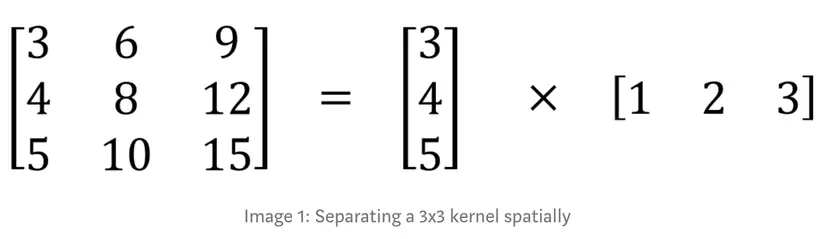

# Separable Convolution

## Spatial Separable Convolutions

Spatial separable convolutions được đặt tên như vậy là vì nó dùng chủ yếu với spatial dimensions của ảnh và kernel, nghĩa là chỉ với width và height. 

Ví dụ 1 kernel 3x3 tách thành 2 kernel nhỏ hơn là 3x1 và 1x3: 

Ở đây thay vì thực hiện 9 phép nhân như kernel cũ thì ta chỉ cần thực hiện 3 phép nhân với mỗi kernel tức là $3 + 3 = 6$ phép nhân. Số lượng phép nhân giảm đi thì độ phức tạp tính toán cũng giảm xuống và mô hình sẽ nhanh hơn. 

Có một vấn đề là không phải kernel nào cũng đều có thể chia thành 2 kernel nhỏ hơn. Nên Spatial Separable Convolutions không được dùng nhiều trong Deep Learning.

## Depthwise Separable Convolutions

Depthwise separable convolutions hoạt động được với các kernel không thể chia thành các kernel nhỏ hơn, khắc phục nhược điểm của Spatial Separable Convolution. Ý tưởng tương tự với spatial separable convolution, `depthwise separable` convolution tách 1 kernel thành 2 kernel riêng biệt là `depthwise convolution` và `pointwise convolution` để thực hiện 2 convolutions.

### Depthwise Convolution

Thực hiện convolution trên ảnh mà không làm thay đổi số lượng kênh của ảnh bằng cách sử dụng 3 kernel. Mỗi kernel sẽ thực hiện phép convolution với mỗi channel tương ứng và cho ra output, sau đó gộp các kết quả lại. 

## Pointwise Convolution

Từ kết quả trước đó, ta thu được output là 8x8x3. Bây giờ làm sao để được 8x8x256 ?? 

Đây chính là nhiệm vụ của pointwise convolution, sử dụng kernel $1 \times 1$ để thực hiện convolution với từng điểm dữ liệu. Kernel sẽ có số lượng channels bằng với số channels của input với mục đích là thu được 1 channel của ảnh đầu ra. 

Tiếp theo là sử dụng 256 kernel $1 \times 1 \times 3$, như vậy ta sẽ thu được ảnh đầu ra là 8x8x256.

## Kết luận

Việc sử dụng depthwise separable convolutions giúp giảm số lượng tham số hơn rất nhiều, làm cho mô hình nhẹ hơn và nhanh hơn rất nhiều so với cách convolution thông thường.

## Case Study

## Tài liệu tham khảo

[https://towardsdatascience.com/efficient-image-segmentation-using-pytorch-part-3-3534cf04fb89/](https://towardsdatascience.com/efficient-image-segmentation-using-pytorch-part-3-3534cf04fb89/)