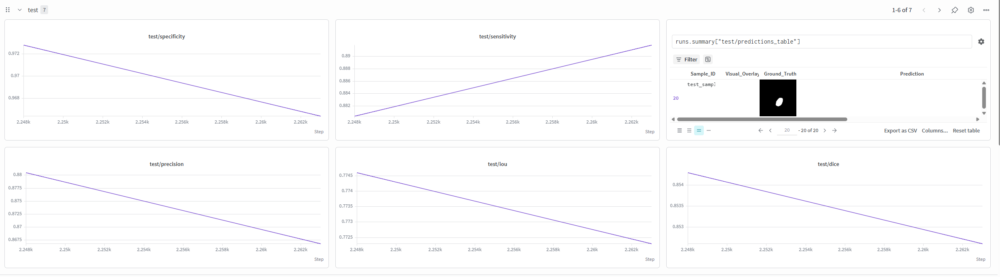

Trong nghiên cứu và phát triển các mô hình trí tuệ nhân tạo, học máy và học sâu, việc thử nghiệm hàng chục đến hàng trăm cấu hình khác nhau là điều tất yếu. Các kỹ sư và nhà nghiên cứu phải liên tục thay đổi kiến trúc mô hình, kỹ thuật tiền xử lý, hàm mất mát, thuật toán tối ưu và các siêu tham số.
Nếu không có một công cụ quản lý và theo dõi thí nghiệm bài bản, toàn bộ quá trình phát triển rất dễ rơi vào tình trạng mất kiểm soát, khó tái lập kết quả và lãng phí tài nguyên tính toán. **Weights & Biases (W&B)** nổi lên như một tiêu chuẩn công nghiệp giải quyết trọn vẹn những thách thức này.

## 1. Tại sao logging thủ công là cản trở lớn trong nghiên cứu ML?

Tron quá trình nghiên cứu và phát triển các mô hình ML và DL, việc thực hiện nhiều thử nghiệm với các cấu hình kiến trúc, thuật toán tối ưu và siêu tham số khác nhau là điều tất yếu. 

Thấy các phương pháp thủ công như ghi log qua console, xuất file csv/excel thường có những hạn chết như: 

- Khó so sánh trực quan hiệu năng giữa các lần chạy
- Không giám sát được tình trạng tài nguyên phần cứng theo thời gian thực
- Tốn nhiều thời gian và công sức khi phải tự viết code dò tìm siêu tham số.

Do đó, một công cụ logging chuyên dụng và hiệu quả là cần thiết. Weights & Biases là giải pháp có thể đáp ứng các nhược điểm này. 

## 2. Giới thiệu Weights & Biases

Weights & Biases (W&B) là một nền tảng MLOps, được thiết kế giúp các nhà khoa học dữ liệu và kỹ sư học máy tối ưu hoá quá trình phát triển mô hình. Để theo dõi các thí nghiệm, quản lý phiên bản và mô hình, cũng như trực quan hoá các chỉ số hiệu suất. 

**Các tính năng cốt lõi**

1. Theo dõi thí nghiệm: ghi lại các hyperparameter, kiến trúc mô hình, các chỉ số như hàm loss,…
2. Tối ưu hoá siêu tham số: tự động hoá quá trình tinh chỉnh siêu tham số, khám phá các tổ hợp tham số khác nhau để tối đa hoá hiệu suất mô hình. 
3. Quản lý Artifact: quản lý phiên bản của tập dữ liệu và mô hình, theo dõi nguồn gốc dữ liệu 
4. Giám sát hệ thống: theo dõi việc sử dụng phần cứng như GPU, bộ nhớ và nhiệt độ. 
5. Hỗ trợ LLM (W&B Weave): Bộ công cụ dành riêng cho AI tạo sinh, cung cấp khả năng theo dõi, đánh giá và gỡ lỗi các ứng dụng LLM, quản lý prompt và chuỗi cấu hình

## 3. Cài đặt và xác thực W&B

**Bước 1:** đăng ký tài khoản W&B

**Bước 2:** Tạo API Key

**Bước 3:** Cài thư viện W&B 

```python
pip install wandb
```

**Bước 4:** xác thực 

Xác thực qua CLI 

```python
wandb login
```

Hệ thống sẽ yêu cầu **dán API key** đã tạo ở Bước 2. Sau khi dán key và nhấn Enter, quá trình xác thực hoàn tất.

## 4. Tích hợp W&B vào training pipeline

### 4.1. Khởi tạo run với `wandb.init()`

Trước khi bắt đầu vòng lặp huấn luyện, cần phải khởi tạo một phiên chạy  để W&B biết dữ liệu này thuộc dự án nào và ghi nhận các cấu hình cố định 

```python
import wandb

config = {
    "lr": 0.001,
    "batch_size": 32,
    "optimizer": "Adam",
}
wandb.init(project="my_project", config=config)
```

### 4.2. Ghi log metrics với `wandb.log()`

Đây là hàm cốt lõi, sẽ gọi nó ở bất kỳ đâu trong vòng lặp huấn luyện để gửi số liệu lên server của W&B. 

```python
for epoch in range(num_epochs):
    running_loss = 0.0
    for batch_idx, (data, target) in enumerate(train_loader):
        # ... code forward, backward, optimizer.step() ...
        loss = criterion(output, target)
        
        # Log loss cho từng batch (step)
        wandb.log({"batch/loss": loss.item()})
    
    # Cuối mỗi epoch, log các metrics tổng hợp
    train_acc = evaluate(model, train_loader)
    val_acc = evaluate(model, val_loader)
    
    wandb.log({
        "epoch": epoch,
        "train/loss": running_loss / len(train_loader),
        "train/accuracy": train_acc,
        "val/accuracy": val_acc,
        "learning_rate": scheduler.get_last_lr()[0]  # Log cả lr đang thay đổi
    })
```

### 4.3. Theo dõi gradients và trọng số với `wandb.watch()`

Tính năng này để debug vanishing/exploding gradient. Chỉ cần gọi wandb.watch() một lần duy nhất sau khi khởi tạo mô hình, trước vòng lặp huấn luyện

```python
model = MyModel()
wandb.watch(
    model,                    # Model cần theo dõi
    log_freq=100,            # Tần suất log (số batch), mặc định là 1000
    log_graph=True           # True nếu muốn log biểu đồ luồng tính toán (computational graph)
)
```

Những gì sẽ nhận được trên dashboard:

- Phân phối của tất cả trọng số và độ lệch theo từng layer
- Phân phối gradients: để phát hiện vanishing và exploding gradient
- Biểu đồ histogram: đánh giá mức độ cập nhật trọng số có hợp lý không.

### 4.4. Trực quan hóa dự đoán trong quá trình huấn luyện

Thay vì chỉ nhìn con số (loss hay accuracy) mơ hồ, hãy để W&B log và render trực tiếp ảnh dự đoán, bảng so sánh để biết mô hình đang học như thế nào qua từng epoch 

**Ví dụ với bài toán phân loại ảnh:**

Log một batch ảnh mẫu để so sánh trực quan.

```python
# Lấy ra một batch dữ liệu validation
sample_images, sample_labels = next(iter(val_loader))
predictions = model(sample_images).argmax(dim=1)

# Tạo bảng để so sánh
table = wandb.Table(columns=["Image", "Ground Truth", "Prediction"])

for img, gt, pred in zip(sample_images, sample_labels, predictions):
    # wandb.Image tự động xử lý tensor (chuyển về PIL, chuẩn hóa kênh)
    table.add_data(wandb.Image(img), str(gt.item()), str(pred.item()))

# Log bảng vào W&B, W&B sẽ tự động render thành gallery ảnh đẹp mắt
wandb.log({"validation/predictions": table, "epoch": epoch})
```

Pipeline mẫu:

```python
import wandb
import torch

# 1. Cấu hình
config = {"lr": 0.01, "batch": 32, "epochs": 10}
wandb.init(project="my_ml_pipeline", config=config)

# 2. Model + Data
model = MyModel()
train_loader, val_loader = get_data(config["batch"])

# 3. Theo dõi trọng số
wandb.watch(model, log_freq=100, log_graph=False)

# 4. Vòng lặp huấn luyện
for epoch in range(config["epochs"]):
    for batch_idx, (x, y) in enumerate(train_loader):
        # Training step...
        loss = ...
        
        # Log metric theo batch (step)
        wandb.log({"batch_loss": loss, "batch": batch_idx})
    
    # Validation cuối epoch
    val_acc = validate(model, val_loader)
    
    # Log metric theo epoch + Đẩy ảnh mẫu lên
    sample_x, sample_y = next(iter(val_loader))
    preds = model(sample_x).argmax(dim=1)
    table = wandb.Table(columns=["Image", "True", "Pred"])
    for i in range(4): # log 4 ảnh đầu
        table.add_data(wandb.Image(sample_x[i]), sample_y[i].item(), preds[i].item())
    
    wandb.log({
        "epoch": epoch,
        "val_accuracy": val_acc,
        "val/examples": table
    })

wandb.finish()
```

## 5. Quản lý phiên bản mô hình với W&B Artifacts

Trong W&B, Artifact là đơn vị dùng để quản lý phiên bản cho bất kỳ tệp nào như tập dữ liệu, file checkpoint mô hình, file cấu hình,… Artifact hoạt động như một “hệ thống git cho file”, có thể đặt tên, gán nhãn và dễ dàng truy xuất lại bất kỳ lúc nào. 

### 5.1. Lưu checkpoint lên cloud

Sau khi huấn luyện xong hoặc tại một thời điểm trong quá trình huấn luyện, ví dụ như validation tốt nhất, ta tạo một artifact và đẩy file checkpoint lên máy chủ W&B 

```python
import wandb
import torch

# Giả sử model đã được huấn luyện và bạn muốn lưu checkpoint tốt nhất
model = MyModel()
torch.save({
    'epoch': epoch,
    'model_state_dict': model.state_dict(),
    'optimizer_state_dict': optimizer.state_dict(),
    'best_val_acc': best_val_acc,
}, "checkpoint_best.pt")

# --- Tạo và Log Artifact ---
# 1. Khởi tạo artifact với tên (format: 'tên_của_artifact' hoặc 'project/artifact_name')
#    type='model' giúp W&B biết đây là mô hình (có các tính năng quản lý đặc biệt)
artifact = wandb.Artifact(name='my_resnet_model', type='model')

# 2. Thêm file checkpoint vào artifact
artifact.add_file('checkpoint_best.pt')

# 3. Đính kèm metadata cho phiên bản này
artifact.metadata = {
    'val_accuracy': best_val_acc,
    'framework': 'PyTorch',
    'dataset_version': 'v2'
}

# 4. Log artifact lên cloud. Hàm này sẽ upload file và liên kết với run hiện tại
wandb.log_artifact(artifact)

# 5. (Quan trọng) Gắn alias (nhãn) cho artifact vừa log.
#    Có thể gắn trực tiếp khi log hoặc gắn sau.
#    Cách 1: Gắn khi log alias='best'
#    wandb.log_artifact(artifact, aliases=['best', 'epoch_10'])

#    Cách 2: Nếu đã log, dùng lệnh sau để gắn thêm alias
#    (Thường thực hiện trong cùng run hoặc run riêng)
#    artifact = wandb.use_artifact('my_resnet_model:v0', type='model')
#    artifact.aliases.append('production')
#    artifact.save()
```

### 5.2. Tải và phục hồi checkpoint cho inference

Khi cần triển khai hoặc chạy inference trên một mô hình đã được lưu trữ, chỉ cần lấy artifact từ cloud và tải file về máy.

```python
import wandb
import torch

# Khởi tạo run (có thể dùng project khác, hoặc cùng project)
wandb.init(project="my_project", job_type="inference")

# --- Tải Artifact ---
# Lấy artifact theo tên và alias. Cú pháp: 'tên_artifact:alias'
# Ví dụ: lấy phiên bản có alias 'best'
artifact = wandb.use_artifact('my_resnet_model:best', type='model')

# Tải file xuống thư mục tạm (mặc định). Hàm trả về đường dẫn thư mục chứa artifact
artifact_dir = artifact.download()

# --- Phục hồi model ---
# load checkpoint từ đường dẫn (file nằm ngay trong thư mục đó)
checkpoint_path = f"{artifact_dir}/checkpoint_best.pt"
checkpoint = torch.load(checkpoint_path)

# Khởi tạo model và load state_dict
model = MyModel()
model.load_state_dict(checkpoint['model_state_dict'])
model.eval()

# Bắt đầu inference...
print(f"Loaded model from epoch {checkpoint['epoch']} with val_acc {checkpoint['best_val_acc']}")
```

### 5.3. Tiếp tục huấn luyện từ checkpoint cũ

Đây là tình huống phổ biến: huấn luyện bị gián đoạn hoặc muốn finetune từ một phiên bản cũ. Cần làm 2 việc cùng lúc:

1. Tải trọng số và trạng thái optimizer cũ
2. Kết nối run W&B hiện tại với run cũ.

```python
import wandb
import torch

# --- 1. Lấy checkpoint cũ từ Cloud ---
wandb.init(project="my_project", job_type="resume_training")

# Lấy artifact cũ (ví dụ phiên bản 'v0' hoặc 'latest')
artifact = wandb.use_artifact('my_resnet_model:v0', type='model')
artifact_dir = artifact.download()
checkpoint = torch.load(f"{artifact_dir}/checkpoint_best.pt")

# --- 2. Khôi phục Model, Optimizer, Scheduler ---
model = MyModel()
model.load_state_dict(checkpoint['model_state_dict'])
optimizer = torch.optim.Adam(model.parameters(), lr=config.lr)
optimizer.load_state_dict(checkpoint['optimizer_state_dict'])  # Quan trọng: giữ nguyên momentum!

start_epoch = checkpoint['epoch'] + 1  # Epoch tiếp theo
best_acc = checkpoint['best_val_acc']

# --- 3. Kết nối W&B Run với RUN cũ (để log tiếp cùng biểu đồ) ---
# Lấy ID của run đã tạo ra artifact cũ (nếu bạn lưu nó trong metadata)
# Cách 1: Nếu bạn lưu run_id trong artifact metadata khi log
# run_id = artifact.metadata.get('run_id')

# Cách 2: Dùng W&B Client để tìm run. Hoặc đơn giản nhất là dùng resume='allow'
# Nếu bạn biết chính xác run_id, hãy dùng:
# wandb.init(project="my_project", id="old_run_id_here", resume="must")

# Trong ví dụ này, tôi sẽ khởi tạo một RUN MỚI nhưng vẫn kế thừa trạng thái model.
# Chú ý: Log sẽ nằm trên 1 dashboard mới (không nối tiếp biểu đồ cũ) nếu không dùng resume.
# Để nối tiếp, hãy sử dụng resume:
wandb.init(
    project="my_project",
    id="old_run_id_here",  # Lấy từ W&B dashboard lần chạy trước
    resume="must"           # 'must' - bắt buộc phải tồn tại run cũ, 'allow' - tạo mới nếu không có
)

# --- 4. Vòng lặp huấn luyện tiếp theo ---
for epoch in range(start_epoch, config.epochs):
    # ... code train loop ...
    # loss = ...
    
    # Log tiếp lên cùng run (nếu đã resume)
    wandb.log({"loss": loss, "epoch": epoch})
    
    # Khi lưu checkpoint mới, nhớ log thành artifact mới (phiên bản mới)
    torch.save({
        'epoch': epoch,
        'model_state_dict': model.state_dict(),
        'optimizer_state_dict': optimizer.state_dict(),
        'best_val_acc': best_acc,
    }, "checkpoint_resumed.pt")
    
    # Log Artifact mới (tăng phiên bản tự động - vì name giống)
    new_artifact = wandb.Artifact('my_resnet_model', type='model')
    new_artifact.add_file('checkpoint_resumed.pt')
    wandb.log_artifact(new_artifact, aliases=['latest'])

wandb.finish()
```

## 6. Tối ưu siêu tham số với W&B Sweeps

W&B Sweeps là công cụ tự động hoá việc tìm kiếm bộ siêu tham số tối ưu. Thày vì thiết viết vòng lặp for thủ công, Sweeps cho phép định nghĩa không gian tìm kiếm, sau đó chạy song song để tìm ra cấu hình tốt nhất. 

### 6.1. Cấu hình không gian tìm kiếm và thuật toán — sweep

Để chạy Sweep, bước đầu tiên bạn cần tạo một file cấu hình thường là dictionary hoặc file YAML. Cấu hình này gồm 3 thành phần chính: không gian tìm kiếm, thuật toán tối ưu và chỉ tiêu đánh giá. 

**Ví dụ**

```python
sweep_config = {
    # 1. PHƯƠNG PHÁP TỐI ƯU
    # 'grid'   : Duyệt toàn bộ tổ hợp
    # 'random' : Lấy mẫu ngẫu nhiên 
    # 'bayes'  : Tối ưu Bayesian 
    'method': 'bayes',
    
    # 2. CHỈ TIÊU CẦN TỐI ƯU (Mục tiêu tối ưu)
    'metric': {
        'name': 'val_accuracy',        # Tên metric được log trong wandb.log()
        'goal': 'maximize'             # 'maximize' hoặc 'minimize'
    },
    
    # 3. KHÔNG GIAN TÌM KIẾM (Các siêu tham số cần tối ưu)
    'parameters': {
        # Loại liên tục (phân phối đều)
        'learning_rate': {
            'distribution': 'uniform',    # hoặc 'log_uniform' (cho các đại lượng thay đổi theo cấp số nhân)
            'min': 1e-5,
            'max': 1e-1
        },
        # Loại rời rạc (lựa chọn trong danh sách)
        'optimizer': {
            'values': ['adam', 'sgd', 'rmsprop']
        },
        # Loại số nguyên
        'batch_size': {
            'distribution': 'int_uniform',
            'min': 16,
            'max': 128
        },
        # Loại phân phối log (cho các tham số như weight_decay)
        'weight_decay': {
            'distribution': 'log_uniform',
            'min': 1e-5,
            'max': 1e-1
        },
        # Loại lựa chọn cố định (không tối ưu nhưng vẫn lưu vào config)
        'dropout_rate': {
            'values': [0.2, 0.3, 0.5]
        },
        # Phụ thuộc (Conditional) – Ví dụ: momentum chỉ áp dụng nếu optimizer là SGD
        'momentum': {
            'distribution': 'uniform',
            'min': 0.8,
            'max': 0.99,
            'conditions': {'optimizer': 'sgd'}  # Chỉ active khi optimizer = 'sgd'
        }
    }
}
```

| **Phương thức** | **Ưu điểm** | **Nhược điểm** | **Khi nào dùng** |
| --- | --- | --- | --- |
| **Grid** | Đơn giản, dễ hiểu, bao phủ toàn bộ | Cực kỳ tốn thời gian nếu nhiều tham số | Không gian chỉ có 2-3 tham số với ít giá trị |
| **Random** | Phân phối đều, không bị mắc kẹt vào vùng cục bộ | Có thể bỏ lỡ vùng tối ưu nếu không đủ số lần chạy | Khi bắt đầu khám phá, chưa biết vùng nào tiềm năng |
| **Bayesian** | Học từ lịch sử, tập trung vào vùng có khả năng tối ưu cao nhất | Nặng về tính toán, nhạy cảm với giá trị ngoại lai ban đầu | **Khuyến nghị mặc định** cho hầu hết bài toán ML/DL |

### 6.2. Xây dựng hàm agent

Hàm Agent là **hàm "cốt lõi"** mà Sweeps sẽ gọi để huấn luyện một model với bộ tham số cụ thể. Hàm này phải:

1. Nhận vào cấu hình sweep 
2. Khởi tạo model, data loader với các tham số được truyền vào
3. Chạy vòng lặp huấn luyện và log metrics
4. Trả về giá trị metric mà sweeps đang tối ưu

```python
import wandb
import torch
from torch import nn, optim
from torch.utils.data import DataLoader

# Tạo model giả định
class SimpleModel(nn.Module):
    def __init__(self, dropout_rate):
        super().__init__()
        self.fc1 = nn.Linear(784, 256)
        self.dropout = nn.Dropout(dropout_rate)
        self.fc2 = nn.Linear(256, 10)
    def forward(self, x):
        x = torch.relu(self.fc1(x))
        x = self.dropout(x)
        return self.fc2(x)

# ------------------ HÀM AGENT CHÍNH ------------------
def train_agent():
    # Khởi tạo Run W&B. Lưu ý: config sẽ được sweep tự động truyền vào
    wandb.init()

    # Lấy siêu tham số từ wandb.config
    config = wandb.config
    lr = config.learning_rate
    batch_size = config.batch_size
    optimizer_name = config.optimizer
    weight_decay = config.weight_decay
    dropout = config.dropout_rate
    epochs = 20  # Fixed

    # Khởi tạo model, dataloader, optimizer, scheduler
    model = SimpleModel(dropout_rate=dropout)
    train_loader = DataLoader(train_dataset, batch_size=batch_size, shuffle=True)
    val_loader = DataLoader(val_dataset, batch_size=batch_size)

    criterion = nn.CrossEntropyLoss()
    
    # Điều kiện để chọn optimizer (có thể lấy cả momentum nếu có)
    if optimizer_name == 'adam':
        optimizer = optim.Adam(model.parameters(), lr=lr, weight_decay=weight_decay)
    elif optimizer_name == 'sgd':
        momentum = config.get('momentum', 0.9)  # Lấy từ config nếu có, mặc định 0.9
        optimizer = optim.SGD(model.parameters(), lr=lr, momentum=momentum, weight_decay=weight_decay)
    else:
        optimizer = optim.RMSprop(model.parameters(), lr=lr, weight_decay=weight_decay)

    # Vòng lặp train
    for epoch in range(epochs):
        # --- Training ---
        model.train()
        total_loss = 0
        for batch_x, batch_y in train_loader:
            optimizer.zero_grad()
            pred = model(batch_x)
            loss = criterion(pred, batch_y)
            loss.backward()
            optimizer.step()
            total_loss += loss.item()
        
        # --- Validation ---
        model.eval()
        correct = 0
        total = 0
        with torch.no_grad():
            for batch_x, batch_y in val_loader:
                pred = model(batch_x)
                _, predicted = torch.max(pred, 1)
                total += batch_y.size(0)
                correct += (predicted == batch_y).sum().item()
        val_acc = correct / total
        
        # --- Log lên W&B (Quan trọng: Tên phải khớp với 'metric.name' trong cấu hình sweep) ---
        wandb.log({
            "loss": total_loss / len(train_loader),
            "val_accuracy": val_acc,       # Đây chính là metric sweep đang theo dõi
            "epoch": epoch
        })
    
    # (Không bắt buộc) Nhưng tốt nhất nên trả về giá trị metric cuối cùng để W&B tự động tổng hợp
    # Thực tế W&B đọc từ lần log cuối cùng, nên không cần return cũng được.
    # Tuy nhiên, nếu bạn dùng logic dừng sớm, hãy đảm bảo log metric ở cuối.
    wandb.finish()
```

### 6.3. Chạy sweep và phân tích kết quả

#### Khởi tạo Sweep và chạy Agent

**Cách 1: Khởi tạo Sweep trên Cloud:**

Dùng câu lệnh sau trong terminal hoặc trong Python để tạo một sweep controller trên server W&B.

```python
# Trong script Python
sweep_id = wandb.sweep(sweep_config, project="my_sweep_project")
```

Sau đó chạy Agent

```python
# Trên Terminal
wandb agent my_username/my_sweep_project/sweep_id
```

hoặc trong python:

```python
wandb.agent(sweep_id, function=train_agent, count=50)
```

**Cách 2: Khởi tạo và chạy trực tiếp trong Notebook:**

```python
sweep_id = wandb.sweep(sweep_config, project="my_sweep_project")
wandb.agent(sweep_id, function=train_agent, count=30)
```

### **Phân tích Kết quả trên dashboard**

Khi Sweep đang chạy hoặc đã kết thúc, bạn vào trang chủ W&B → Dự án → Tab **Sweeps** để thấy giao diện phân tích mạnh mẽ nhất của W&B.

**1. Bảng tổng hợp:**

Hiển thị tất cả các run đã chạy, kèm các siêu tham số và giá trị metric cuối cùng. Bạn có thể sắp xếp theo **val_accuracy** để tìm ra run tốt nhất ngay lập tức.

**2. Biểu đồ Parallel Coordinates**

Cho phép kéo thả để lọc các run có độ chính xác cao và nhìn thấy ngay lập tức vùng giá trị nào của **learning_rate** hay **batch_size** đang cho kết quả tốt nhất.

- Trục ngang: các siêu tham số.
- Trục dọc: metric mục tiêu.
- Màu sắc: thể hiện giá trị metric.

**3. Biểu đồ tương quan**

Biểu đồ này hiển thị mức độ ảnh hưởng của từng siêu tham số đến metric. Ví dụ: nếu `learning_rate` có thanh màu xanh đậm (tương quan dương cao) nghĩa là tăng `lr` sẽ tăng `val_accuracy`.

**4. Biểu đồ Scatter**

Chọn 2 tham số bất kỳ, W&B sẽ vẽ ra bản đồ nhiệt cho thấy khu vực tham số nào cho độ chính xác cao nhất. Ví dụ: Scatter plot giữa `learning_rate` và `batch_size` với màu sắc là `val_accuracy`.

**5. Chọn và lưu best model:**

Khi tìm được run tốt nhất (ví dụ có `val_accuracy` cao nhất), nhấp vào run đó, sẽ thấy nó được sinh ra từ bộ siêu tham số nào. Ta có thể tạo alias cho Artifact của lần chạy đó:

```python
wandb artifact put --name my_model --type model --alias sweep-best path/to/best_checkpoint.pt
```

## 7. Best practices và kinh nghiệm thực tế

### 7.1. Đặt tên và tổ chức run

Việc đặt tên run một cách có hệ thống là rất quan trọng để không bị lạc giữa hàng trăm run sau vài tháng nghiên cứu. 

**Quy tắc khi đặt tên run**

```python
<model_architecture>-<dataset>-<experiment_type>-<hyperparams_tóm_tắt>
```

Ví dụ: 

```python
wandb.init(
	project="image_classification", 
	name="resnet50-cifar10-baseline-bs64-lr0.001",
	config={
		"model":"resnet50",
		"dataset": "cifar10",
		"batch_size": 64, 
		"learning_rate": 0.001,
		"experiment": "baseline"
	}
)
```

**Tổ chức project và run** 

| **Cấp độ** | **Cách tổ chức** | **Lợi ích** |
| --- | --- | --- |
| **Project** | Mỗi dự án, dataset lớn một project riêng | Tránh lẫn lộn giữa các bài toán khác nhau |
| **Group** | Dùng `wandb.init(group="experiment_name")` để nhóm các run cùng loại | Dễ dàng so sánh các run trong cùng một thí nghiệm |
| **Job Type** | `wandb.init(job_type="train")` / `"eval"` / `"sweep"` | Phân biệt mục đích của run |

| **Loại Group** | **Mục đích** | **Ví dụ cụ thể** |
| --- | --- | --- |
| **backbone_comparison** | So sánh các backbone/encoder | `unet-resnet50`, `unet-efficientnet-b3`, `deeplabv3-mobilenet` |
| **loss_function** | Thử nghiệm các tổ hợp loss | `dice_only`, `bce_only`, `dice+bce`, `focal_tversky` |
| **augmentation** | Đánh giá tác động của augmentation | `no_aug`, `weak_aug` (flip), `strong_aug` (elastic + rotation) |
| **hyperparameter_tuning** | Tối ưu siêu tham số | `lr_1e-3`, `lr_1e-4`, `bs_16`, `bs_32`, `adam_vs_sgd` |
| **architecture** | Thử nghiệm kiến trúc khác nhau | `unet`, `unet++`, `segformer`, `deeplabv3` |
| **post_processing** | Hậu xử lý sau segmentation | `crf`, `morphological`, `conditional_random_field` |
| **ensemble** | Kết hợp nhiều mô hình | `unet_resnet50_unet++`, `voting_ensemble`, `stacking` |
| **pretrained_vs_scratch** | So sánh pretrained vs scratch | `pretrained_imagenet`, `scratch` |
| **data_strategy** | Chiến lược dữ liệu | `full_dataset`, `subset_10%`, `balanced`, `class_weighted` |
| **resolution** | Ảnh hưởng của độ phân giải | `sz128`, `sz256`, `sz512` |
| **validation_strategy** | Phương pháp validation | `kfold_5`, `train_val_80_20`, `leave_one_out` |
| **uncerainty** | Đánh giá độ không chắc chắn | `mc_dropout`, `ensemble_variance`, `test_time_aug` |

| **Job Type** | **Khi nào sử dụng** | **Ví dụ** |
| --- | --- | --- |
| **training** | Run chính thức train model | Training full epochs với validation |
| **sweep** | Chạy trong quá trình tối ưu siêu tham số | W&B Sweep (tự động thêm) |
| **debug** | Kiểm tra pipeline, số epochs nhỏ (1-5) | Kiểm tra loss không bị NaN, code chạy đúng |
| **validation** | Chỉ đánh giá trên val set, không train | Kiểm tra model đã lưu trên validation |
| **test** | Đánh giá cuối cùng trên test set | Chạy inference và tính metrics (Dice, IoU) |
| **inference** | Dự đoán trên ảnh mới | Áp dụng model cho ảnh lâm sàng |
| **baseline** | Chạy baseline để so sánh | UNet cơ bản không augmentation, loss đơn giản |
| **ablation** | Thí nghiệm ablation study | Bỏ đi một thành phần để xem ảnh hưởng |
| **ensemble** | Chạy ensemble các model | Kết hợp 3 model để tăng độ chính xác |

**Ví dụ tổ chức đa cấp:**

```python
# Run cho thí nghiệm baseline
wandb.init(
    project="nlp_sentiment_analysis",
    group="baseline_experiments",
    job_type="training",
    name="lstm-embed256-baseline"
)

# Run cho thí nghiệm với attention
wandb.init(
    project="nlp_sentiment_analysis",
    group="attention_experiments",
    job_type="training",
    name="lstm-embed256-attention"
)
```

**Mẹo từ thực tế:** luôn thêm timestamp vào tên run khi chạy tự động (ví dụ: `resnet50-cifar10-20260125-1430`) để dễ dàng tracking theo thời gian.

### 7.2. Logging hiệu quả, không quá ít, không quá nhiều

Log quá ít thì không đủ dữ liệu để phân tích, log quá nhiều thì làm chậm training và đầy dashboard

**Những gì nên log:** 

```python
wandb.log({
    # 1. Metrics chính (loss, accuracy, ...)
    "train/loss": loss,                    # Nên nhóm theo prefix
    "train/accuracy": train_acc,
    "val/accuracy": val_acc,
    
    # 2. Hyperparameters đang thay đổi
    "learning_rate": current_lr,           # Đặc biệt quan trọng với schedulers
    "epoch": epoch,
    
    # 3. Thông tin debug khi cần
    "gradient_norm": grad_norm,            # Kiểm tra exploding gradients
    "batch_time": batch_time,              # Theo dõi hiệu suất training
})
```

**Tần suất Logging tối ưu**

| **Loại dữ liệu** | **Tần suất khuyến nghị** | **Lý do** |
| --- | --- | --- |
| **Loss, Accuracy** (train) | Mỗi 10-100 batches | Không cần log mỗi batch, chỉ làm đầy dashboard |
| **Loss, Accuracy** (val) | Mỗi epoch | Đủ để theo dõi xu hướng |
| **Learning Rate** | Mỗi epoch hoặc khi thay đổi | Quan trọng để debug |
| **System Metrics** | W&B tự động (mặc định) | Không cần can thiệp |
| **Images/Tables** | 1 lần/epoch (sample 4-8 ảnh) | Để theo dõi chất lượng dự đoán |

### 7.3. Sử dụng tags và notes để phân loại

Tags và Notes là công cụ **phân loại và tìm kiếm** của W&B, đặc biệt khi bạn có hàng trăm run.

**Tags:** tag giúp nhóm các run theo tiêu chí logic:

```python
wandb.init(
    project="my_project",
    tags=[                     # Danh sách các tag
        "baseline",            # Loại thí nghiệm
        "resnet50",            # Kiến trúc
        "pretrained",          # Có sử dụng pre-trained weights
        "mixup_augmentation",  # Kỹ thuật augmentation
        "early_stop",          # Có dùng early stopping
    ]
)
```

**Cách dùng tags hiệu quả:**

- **Kỹ thuật**: `"data_augmentation"`, `"mixup"`, `"cutmix"`, `"label_smoothing"`
- **Kiến trúc**: `"cnn"`, `"transformer"`, `"resnet50"`, `"vit_base"`
- **Trạng thái**: `"baseline"`, `"experimental"`, `"production_candidate"`
- **Dataset**: `"cifar10"`, `"imagenet_subset"`, `"augmented_v2"`

**Tìm kiếm với Tags:**

- Trên dashboard, bạn có thể lọc các run bằng tags
- Ví dụ: chỉ xem các run có tag `"baseline"` và `"resnet50"`

**Notes:**  

là nơi bạn ghi lại ngắn gọn, đầy đủ những điều cần nhớ về run đó:

```python
# Sau khi hoàn thành run
wandb.run.notes = """
Thí nghiệm với ResNet50, pretrained trên ImageNet.
- Sử dụng learning rate scheduler (ReduceLROnPlateau)
- Dữ liệu augmentation: RandomHorizontalFlip + RandomRotation(15)
- Kết quả: val_acc = 0.893, tốt hơn baseline 0.5%
- Nhận xét: model bị overfit nhẹ sau epoch 30
"""
```

**Ghi chú nên chứa:**

- **Mục đích** của thí nghiệm
- **Điểm đặc biệt** (khác với các run khác)
- **Kết quả chính** (ngắn gọn)
- **Nhận xét/Phát hiện** (quan trọng!)

**Mẹo:** Notes là cứu cánh khi quay lại dự án sau 3 tháng và không nhớ tại sao mình lại chạy thí nghiệm đó

### 7.4. Xử lý lỗi và resume run

Trong thực tế, training thường bị gián đoạn do lỗi. W&B cung cấp cơ chế **resume run** để tiếp tục từ vị trí dừng mà không mất dữ liệu.
**Trường hợp 1: Biết trước run_id**

```python
import wandb

# Khi bắt đầu run lần đầu
run = wandb.init(project="my_project", name="experiment_001")
run_id = run.id  # Lưu lại run_id này

# Khi resume (chạy lại sau khi bị lỗi)
wandb.init(
    project="my_project",
    id=run_id,              # ID của run cũ
    resume="allow"          # "must": bắt buộc resume; "allow": resume nếu có, tạo mới nếu không
)
```

**Trường hợp 2: Resume từ Artifact**

```python
import wandb
import torch

# 1. Tải checkpoint từ Artifact cũ
artifact = wandb.use_artifact('my_model:latest', type='model')
artifact_dir = artifact.download()
checkpoint = torch.load(f"{artifact_dir}/model_checkpoint.pt")

# 2. Khởi tạo lại model và optimizer với trạng thái cũ
model = MyModel()
model.load_state_dict(checkpoint['model_state_dict'])

optimizer = torch.optim.Adam(model.parameters(), lr=config.lr)
optimizer.load_state_dict(checkpoint['optimizer_state_dict'])

start_epoch = checkpoint['epoch'] + 1

# 3. Resume W&B run (nếu biết run_id, hoặc tạo run mới)
wandb.init(
    project="my_project",
    id=checkpoint.get('run_id'),  # Nếu bạn lưu run_id trong checkpoint
    resume="allow" if checkpoint.get('run_id') else "never"
)

# 4. Tiếp tục vòng lặp training
for epoch in range(start_epoch, config.epochs):
    # ... training code ...
    wandb.log({"epoch": epoch, "loss": loss})
```

## 8. Case Study: phân vùng tổn thương da với UNet

Toàn bộ mã nguồn thực thi pipeline huấn luyện, đánh giá và quản lý artifact với W&B trên tập dữ liệu ISIC 2018 được cung cấp chi tiết trong file Jupyter Notebook đính kèm bên dưới:

> 📥 **Tải về Jupyter Notebook:** [`train_evaluate_save_model.ipynb`](/blog/wandb-logging/train_evaluate_save_model.ipynb)  
> *(Bạn có thể tải file về để mở trực tiếp trong VS Code, Jupyter Lab hoặc tải lên Google Colab / Kaggle để chạy).*

## 9. Kết quả và trực quan hóa




## 10. Kết luận và hướng phát triển

| **Lộ trình phát triển** | **Hành động cụ thể** |
| --- | --- |
| **Cấp độ Cơ bản** | Thành thạo các tính năng cốt lõi: init, log, watch, artifact |
| **Cấp độ Trung cấp** | Sử dụng Sweeps, tạo Reports, tích hợp CI/CD |
| **Cấp độ Nâng cao** | Xây dựng pipeline tự động, quản lý multiple projects, deployment monitoring |
| **Đóng góp cộng đồng** | Chia sẻ best practices, viết blog, đóng góp open-source |

## Tài liệu tham khảo

1. **Weights & Biases Documentation** – [https://docs.wandb.ai/](https://docs.wandb.ai/)
2. **W&B Quickstart Guide** – [https://docs.wandb.ai/quickstart](https://docs.wandb.ai/quickstart)
3. **W&B Sweeps Documentation** – [https://docs.wandb.ai/guides/sweeps](https://docs.wandb.ai/guides/sweeps)
4. **W&B Artifacts Guide** – [https://docs.wandb.ai/guides/artifacts](https://docs.wandb.ai/guides/artifacts)
5. **W&B Reports** – [https://docs.wandb.ai/guides/reports](https://docs.wandb.ai/guides/reports)